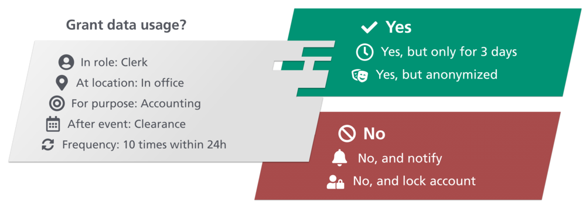
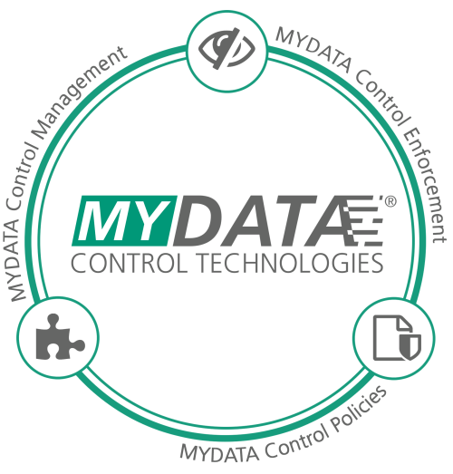

# Developer Documentation

More and more business models require the exchange and processing of business-critical data. 
The legislator considers personal data to be particularly worthy of protection. 
MYDATA Control Technologies offers both business partners and citizens more transparency and self-determination in the use of their data.
Many existing technologies do not offer a practical solution to these challenges. 
They only enable simple yes/no decisions (i.e., "allow access" or "deny access") and do not provide enough flexibility for the definition of complex usage control restrictions (e.g., "allow access, but only in anonymized form", "yes, but delete data after 3 days"). 

MYDATA Control Technologies closes this gap: The data owner can define his individual requirements with regard to data security and privacy, which are then technically enforced by our technology.
MYDATA Control Technologies is a software solution for the evaluation, enforcement and management of security and privacy rules.  
For the technical realization, MYDATA Control Technologies intercepts data flows and offers comprehensive control options.
Data in motion can be masked and filtered in fine granular form, for example to make it anonymous. 
The modular and component-based structure of MYDATA Control Technologies allows a simple integration into existing systems.

In the following, you will learn how to integrate and use MYDATA Control Technologies.

## Policy Enforcement 

MYDATA Control Technologies intercepts events or data flows and enforces a security decision based on policies.
This process is highly customizable by different kinds of plugins to provide full flexibility for all use cases.

**Event Monitoring, Filtering and Masking:**
MYDATA Control Technologies monitors, filters or masks data usages and requests based on the active rule set. 
This is done by so-called "Policy Enforcement Points", which can modify (Json serialized) data on the fly.
Policy Enforcement Points are highly flexible and customizable.
Example modifications could be:

* Removing all customer addresses 
* Anonymizing person names
* Coarsing GPS locations
* Adding copyright notice to a text

**Execution of Actions:**
MYDATA Control Technologies executes (compensatory or additional) actions based on the active rule set. 
This execution is done by so-called "Policy Execution Points", which you can register in our system.
Policy Execution Points might for example

* send E-Mail notifications
* create log entries
* trigger a business process

**Connecting to External Information Sources:**
MYDATA Control Technologies integrates all kinds of information sources, e.g., location data, directory information.
This execution is done by so-called "Policy Information Points", which you can register in our system.
Policy Information Points can, for example be used to

* check a user role via LDAP
* check the user’s context (e.g., "traveling" or "in the office")
* check if the weather is nice in Berlin

[**Click here to learn how to use our Library.**](./sdk/howto_library.html) 

## Policy Language

The MYDATA Control Technologies policy language is designed to express restrictions on data usage. 
It is an XML-based language, providing the following features:

* boolean logic
* arithmetics 
* temporal information based on an event history
* policy evaluation based on push (event-triggered) or pull (timer-triggered)
* connection to external systems for information retrieval (via PIP plugins)
* enforcement by data modification using JsonPath (via PEP modifier plugins)
* enforcement by execution of actions (via PXP plugins)

[**Click here to learn more about our policy language.**](./language) 

## Central Services

Depending on the use case, purely local policy evaluation reaches its limits. 
For these cases, we offer central and highly scalable services for policy evaluation and management that you can easily integrate into your IT infrastructure.

In order to use our central services, you can communicate with our services via REST interfaces. 

[**Click here for documentation and usage via Swagger.**](https://management.dev.mydata-control.de/swagger-ui.html) 

## Resources

* JavaDocs are available for our [Core](./api-core), [SDK](./api-sdk) and [Spring SDK](./api-sdk-spring).
* Release notes are available [here](./release-notes/).
* Migration Guides are available [here](./migrationGuide).
* Glossary is available [here](./glossary).

## Legal
- [MYDATA Data Protection Policy](https://www.mydata-control.de/privacy_policy.html)
- [GitHubData Protection Policy](https://docs.github.com/de/site-policy/privacy-policies/github-privacy-statement)
- [Imprint](https://www.iese.fraunhofer.de/de/impressum.html)