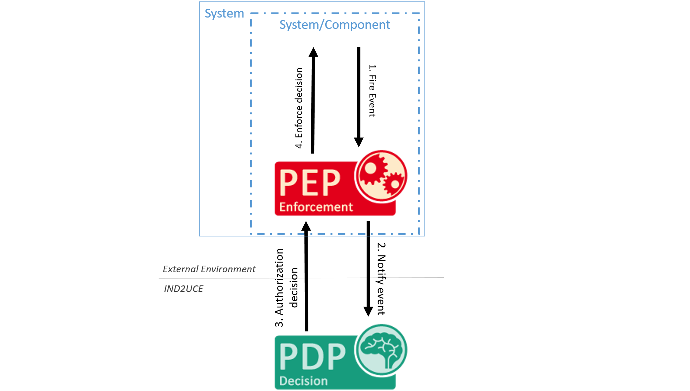

# Policy Language

## Introduction

This documentation is about the specification of **privacy policies with the MYDATA Control Technologies policy language** regulating security-relevant system events.
The MYDATA Control Technologies policy language is designed to express restrictions on data usage. 
It is an XML-based language, based on **boolean logic, arithmetics, temporal information based on an event history**.
Furthermore, it allows for evaluations based on push (event-triggered) or pull (timer-triggered).
Connection to external systems for information retrieval is fully supported.
Enforcement decisions can be specified by means of **event inhibition, data modification using JsonPath (via PEP modifier plugins) and via the execution of actions (via PXP plugins)**.

<button type="button" id="toggleButton" style="background-color: #1f82c0; border: none; color: white; padding: 6px 12px; text-align: center; text-decoration: none; display: inline-block; font-size: 1rem;">Show table of contents</button>
<div id="toc" class='collapsed'>
<ul>
  <li>
	Policy:
	<a href="#policy">policy</a>,
	<a href="#mechanisms">mechanism</a>,
	<a href="#working-with-variables">variableDeclaration</a>
  </li>

  <li>
	Conditions:
	<a href="#conditions">if</a>,
	<a href="#conditions">elseif</a>
  </li>

  <li>
	Decisions:
	<a href="#then_else">then</a>,
	<a href="#then_else">else</a>,
	<a href="#then_else">allow</a>,
	<a href="#then_else">allow</a>,
	<a href="#complex-decisions-with-event-modifications">modify</a>,
	<a href="#execution-of-external-events">execute</a>
  </li>

  <li>
	Variables:
	<a href="#working-with-variables">variable:boolean</a>,
	<a href="#working-with-variables">variable:number</a>,
	<a href="#working-with-variables">variable:string</a>,
	<a href="#working-with-variables">variable:object</a>,
	<a href="#working-with-variables">variable:list</a>
  </li>

  <li>
	Parameters:
	<a href="#parameters">parameter:boolean</a>,
	<a href="#parameters">parameter:number</a>,
	<a href="#parameters">parameter:string</a>,
	<a href="#parameters">parameter:object</a>,
	<a href="#parameters">parameter:list</a>
  </li>

  <li>
	Event References:
	<a href="#event-references">event:boolean</a>,
	<a href="#event-references">event:number</a>,
	<a href="#event-references">event:string</a>,
	<a href="#event-references">event:object</a>,
	<a href="#event-references">event:list</a>,
	<a href="#checking-whether-an-event-has-a-specific-parameter">eventHasParameter</a>
  </li>

  <li>
	Constants:
	<a href="#constants">constant:boolean</a>,
	<a href="#constants">constant:number</a>,
	<a href="#constants">constant:string</a>,
	<a href="#constants">constant:object</a>,
	<a href="#constants">constant:list</a>
  </li>

  <li>
	PIPs:
	<a href="#external-information-sources-pips">pip:boolean</a>,
	<a href="#external-information-sources-pips">pip:number</a>,
	<a href="#external-information-sources-pips">pip:string</a>,
	<a href="#external-information-sources-pips">pip:object</a>,
	<a href="#external-information-sources-pips">pip:list</a>
  </li>

  <li>
	Arithmetic Functions:
	<a href="#arithmetic-functions">plus</a>,
	<a href="#arithmetic-functions">minus</a>,
	<a href="#arithmetic-functions">multiply</a>,
	<a href="#arithmetic-functions">divide</a>,
	<a href="#arithmetic-functions">size</a>
  </li>

  <li>
	Boolean Functions:
	<a href="#basic-boolean-functions">and</a>,
	<a href="#basic-boolean-functions">or</a>,
	<a href="#basic-boolean-functions">xor</a>,
	<a href="#basic-boolean-functions">not</a>,
	<a href="#basic-boolean-functions">implies</a>,
	<a href="#checking-if-a-list-contains-certain-elements">contains</a>,
	<a href="#regular-expressions">regex</a>
  </li>

  <li>
	Comparison Functions:
	<a href="#comparison-functions">less</a>,
	<a href="#comparison-functions">lessEqual</a>,
	<a href="#comparison-functions">equals</a>,
	<a href="#comparison-functions">greaterEqual</a>,
	<a href="#comparison-functions">greater</a>
  </li>

  <li>
	Date Functions:
	<a href="#date-functions">date</a>,
	<a href="#date-functions">day</a>,
	<a href="#date-functions">time</a>
  </li>

  <li>
	Event History:
	<a href="#counting-of-events">count</a>,
	<a href="#evaluation-of-changes-over-time">valueChanged</a>,
	<a href="#evaluation-of-periodic-events">continuousOccurrence</a>,
	<a href="#referring-to-an-event-in-the-event-history">eventOccurrence</a>,
	<a href="#dynamic-time-spans">when</a>
  </li>

  <li>
	Concatenation:
	<a href="#string-concatenation-concat">concat</a>
  </li>

  <li>
	Cron Jobs / Time Triggered Events:
	<a href="#working-with-cron-jobs">timer</a>,
	<a href="#working-with-cron-jobs">event</a>
  </li>
</ul>

</div>

<script type="text/javascript">

	document.getElementById("toggleButton").addEventListener("click", function() {
		var toc = document.getElementById("toc");
		if (toc.classList.contains("collapsed")) {
			toc.classList.remove("collapsed");
			toc.classList.add("expanded");
			this.textContent = "Hide table of contents";
		} else {
			toc.classList.remove("expanded");
			toc.classList.add("collapsed");
			this.textContent = "Show table of contents";
		}
	});

</script>

## The Event-Condition-Action Schema

MYDATA Control Technologies defines policies based security-relevant [**events**](../api-core/de/fraunhofer/iese/mydata/api/policy/Event.html) that are occurring at a certain time in a system and are intercepted by **"Policy Enforcement Point" (PEP)**.
These events are sent to a **"Policy Decision Point" (PDP)**, which evaluates the policies and returns an [**Authorization Decision**](../api-core/de/fraunhofer/iese/mydata/api/policy/AuthorizationDecision.html) based on the policies.
This decision is then enforced by the PEP.




Depending on the system and PEP type, events can highly differ.
In general, events contain:

* An action name that defines the type of the event 
* The time the event occurred 
* A key-value list with event parameters 

The following example shows an event we will refer to multiple times in this documentation.
It shows an event that is executed when someone reads bank transactions in a web service.

**Example Event for Banking**
```
Event ID: "urn:action:banking-demo:get-transactions"
Time: 1533545200 
Parameters:
 - "customerID" (Number)
 - "psd2Id" (Number)
 - "transactions" (List of Transaction Objects)
```

MYDATA Control Technologies policies are based on the **Event-Condition-Action** (ECA).
If a system **event E** (see above) is fetched and a **condition C** is satisfied, then **action A** (authorization decision) is performed. 
MYDATA Control Technologies follows a blacklisting approach.
Events that are not covered by policies are allowed by default.

The following policy shows a simple example. 
It translates to: "**Inhibit** the event **urn:action:banking-demo:get-transactions** if it is **after 3pm** (i.e., if the external information source getCurrentHour returns a value below or equal to 15)"

**Example MYDATA Control Technologies security policy**
```xml
<policy id='urn:policy:banking-demo:getTransactions'>
  <mechanism event='urn:action:banking-demo:get-transactions'> <!-- Event -->
    <if> <!-- Condition -->
      <less>
        <pip:number method='urn:info:banking-demo:getCurrentHour' default='0'/>
        <constant:number value='15'/>
      </less>
      <then>
        <inhibit/> <!-- Action -->
      </then>
    </if>
  </mechanism>
</policy>
```

## Policy Structure

A **[policy](#policy)** consists of one or more **[mechanisms](#mechanisms)** that are based on the **Event-Condition-Action** (ECA) schema.
MYDATA Control Technologies follows a blacklisting approach.
Events that are not covered by policies are allowed by default.

### Policy

The **&lt;policy&gt;** tag is the root element of an MYDATA Control Technologies security policy. It has the following attributes:

|Attribute    |Type      |Required 		|Meaning |
| -- | -- | -- | -- |
|id           |URN       |required      |The unique id of the policy. The id syntax is urn:policy:&lt;solution&gt;:&lt;identifier&gt;. The &lt;solution&gt; matches your solution ID and defines the range of effect. The &lt;identifier&gt; uniquely identifies the policy within the scope. |
|name         |String    |optional      |A human readable (short) name for the policy.| 
|description  |String    |optional      |A more detailed natural language description of the security policy.|

The **&lt;policy&gt;** tag must have at least one **[mechanism](#mechanisms)** child and can optionally contain **[variableDeclarations](#working-with-variables)**.

### Mechanisms

A **&lt;mechanism&gt;** tag describes a rule of a policy based on a monitored, intercepted or [time triggered](#working-with-cron-jobs) event.
An intercepted event can be allowed (event is released and executed normally),
modified (the event is changed according to the modifiers specified in the mechanism before it is executed) or
inhibited (the event is dropped and will not be executed). A time triggered or monitored event cannot be inhibited or modified - thus, are always allowed.
You can use [PXPs](#execution-of-external-events) to react on these events.

The **&lt;mechanism&gt;** element has the following attributes:


|Attribute    |Type      |Required 		|Meaning |
| -- | -- | -- | -- |
|event        |URN  	 |required      |Specifies the event by which the mechanism is triggered and for which the mechanism provides a security rule. The event follows this pattern: urn:action:&lt;solution&gt;:&lt;identifier&gt;|
|id           |String    |optional      |A unique id for the mechanism, used for logging purposes only.|
|description  |String    |optional      |A natural language description of the mechanism.|


Mechanisms follow the **if-then-else** schema. 
Thus, a **&lt;mechanism&gt;** tag can have the following children:

* &lt;[if](#conditions)&gt;: A condition that leads to an authorization decision if it matches
* &lt;[elseif](#conditions)&gt;: A condition that leads to an authorization decision if it matches and the previous if or else-ifs did not match
* &lt;[else](#then_else)&gt;: A condition that leads to an authorization decision if none of the previous if or else-ifs matched
* &lt;[execute](#execution-of-external-events)&gt;: The unconditional execution of an action

> **📜 Policy Specification Rules**
> * The child element &lt;[if](#conditions)&gt; is mandatory and only allowed to be used once within a &lt;[mechanism](#mechanisms)&gt;.
> * The child element &lt;[else](#then_else)&gt; is optional but only allowed to be used once within a &lt;[mechanism](#mechanisms)&gt; also.
> * The child elements &lt;[elseif](#conditions)&gt; and &lt;[execute](#execution-of-external-events)&gt; may be used multiple times.

> **❗Policy Evaluation Rules**
> * A specified &lt;[execute](#execution-of-external-events)&gt; as a direct child of &lt;mechanism&gt; the &lt;[mechanism](#mechanisms)&gt; tag is triggered independently of the satisfaction of a condition.

**Example: Inhibits access to transactions after 3pm and log the event**
```xml
<policy id='urn:policy:banking-demo:getAccounts' description='Inhibits access to transactions and loggs the action'>
  <mechanism event='urn:action:banking-demo:get-transactions'>
    <if>
      <less>
        <pip:number method='urn:info:banking-demo:getCurrentHour' default='0'/>
        <constant:number value='15'/>
      </less>
      <then>
        <inhibit/>
        <execute action='urn:action:banking-demo:logNotification'>
       		<parameter:string name='message' value='Access attempt to account data after 3pm'/>
    	</execute>
      </then>
    </if>
    <else>
    	<allow/>
    	<execute action='urn:action:banking-demo:logNotification'>
       		<parameter:string name='message' value='Access attempt to account data before 3pm'/>
    	</execute>
    </else>
    <execute action='urn:action:banking-demo:logNotification'>
       <parameter:string name='message' value='Access attempt to account data'/>
    </execute>
  </mechanism>
</policy>
```

### Conditions

The **&lt;if&gt;** and the **&lt;elseif&gt;** elements declare the condition that is evaluated each time the mechanism fires.

A condition must have the following child elements:

* A [boolean-function](#boolean-operators) that defines the condition
* A &lt;[then](#then_else)&gt; that defines an authorization decision that the mechanism enforces if the condition matches


> **📜Policy Specification Rules**
> * The &lt;if&gt; and the &lt;elseif&gt; must have exactly one boolean function and one &lt;then&gt; child

> **❗Policy Evaluation Rules**
> * If the &lt;if&gt; condition is not satisfied, then the first &lt;elseif&gt; condition will be evaluated.
> * Only the &lt;then&gt; element of the **first** satisfied &lt;if&gt; or &lt;elseif&gt; condition will be enforced.
> * If no condition is satisfied, then the action defined in the &lt;else&gt; element will be executed.
> * If no condition is satisfied and no &lt;else&gt; element is specified, then the event will be allowed (blacklisting).

Example: Prohibit access to transactions after 3pm and log access to transactions between 2pm and 3pm
```xml
<policy id='urn:policy:banking-demo:getTransactions'>
  <mechanism event='urn:action:banking-demo:get-transactions'>
    <if>
      <lessEqual>
        <constant:number value='15'/>
        <pip:number method='urn:info:banking-demo:getCurrentHour' default='0'/>
      </lessEqual>
      <then>
        <inhibit/>
      </then>
    </if>
    <elseif>
      <and>
         <greaterEqual>
           <pip:number method='urn:banking-demo:getCurrentHour' default='0'/>
           <constant:number value='14'/>
         </greaterEqual>
         <less>
           <pip:number method='urn:info:banking-demo:getCurrentHour' default='0'/>
           <constant:number value='15'/>
         </less>
      </and>
      <then>
        <execute action='urn:action:banking-demo:logNotification'>
          <parameter:string name='message' value='Access attempt to account data between 2 and 3pm'/>
        </execute>
      </then>
    </elseif>
    <else>
      <constant:true/>
      <then>
        <allow/>
        <execute action='urn:action:banking-demo:logNotification'>
          <parameter:string name='message' value='Someone accessed the transactions'/>
        </execute>
      </then>
    </else>
  </mechanism>
</policy>
```

### Decisions

Decisions are defined inside a **&lt;then&gt;** element inside a [condition](#conditions) (&lt;if&gt; or &lt;elseif&gt;), or in an **&lt;else&gt;** element, which is used if no condition is fulfilled.
These two elements can have the following child elements:

* &lt;[allow](#then_else)&gt;: The event will be allowed
* &lt;[modify](#complex-decisions-with-event-modifications)&gt;: The event is allowed, but modified before further execution
* &lt;[inhibit](#then_else)&gt;: The event will be inhibited
* &lt;[execute](#execution-of-external-events)&gt;: Additional actions are executed, independent of the event allowance 

> **📜Policy Specification Rules**
> * The &lt;then&gt; and the &lt;else&gt; elements must have at either
> ** exactly one [binary decision](#then_else) (&lt;allow&gt;, &lt;inhibit&gt;), or
> ** at least one [event modification](#complex-decisions-with-event-modifications) (&lt;modify&gt;), and
> ** multiple [executes](#execution-of-external-events), which are executed in the specified order.

**Example: If the role of the user is "ROLE_USER" **then** modify task desricption, name and budget; **else** inhibit**
```xml
<policy id='urn:policy:cs4:anonymizeTasksOfOthers'>
  <mechanism event='urn:action:cs4:show-task'>
    <if>
      <equals>
        <pip:string method='urn:info:cs4:getRoleByUsername' default=''>
          <parameter:string name='userId'>
            <event:string eventParameter='user' default='' jsonPathQuery='$.userId'/>
          </parameter:string>
        </pip:string>
        <constant:string value='ROLE_USER'/>
      </equals>
      <then>
        <modify eventParameter='task' method='anagram' jsonPathQuery='$.description'>
          <parameter:number name='percentage' value='100'/>
        </modify>
        <modify eventParameter='task' method='replace' jsonPathQuery='$.name'>
          <parameter:string name='replaceWith' value='**********'/>
        </modify>
        <modify eventParameter='task' method='delete' jsonPathQuery='$.budget'/>
      </then>
    </if>
    <else>
      <inhibit/>
    </else>
  </mechanism>
</policy>
```

### Simple Decisions
Similar to basic access control mechanisms, an event can be allowed or inhibited.
The **&lt;allow&gt;** tag is part of a positive authorization decision. It informs the PEP that the intercepted event can be released for reaching its destination.
The **&lt;inhibit&gt;** tag is part of a negative authorization decision. It informs the PEP that the intercepted event must be dropped so that it never reaches its destination.
A reason can be added to both elements:

**Allow and inhibit attributes**

|Attribute    |Type      |Required  	  |Meaning |
| -- | -- | -- | -- |
|reason       |String    |optional        |The description or rationale for the decision.|

**Example: If role is banker then **allow** the event "get transactions" else **inhibit** the event**
```xml
<policy id='urn:policy:banking-demo:checkRoleExample'>
  <mechanism event='urn:action:banking-demo:get-transactions'>
    <if>
      <equals>
        <pip:string method='urn:info:banking-demo:checkRole' default=''/>
        <constant:string value='Banker'/>
      </equals>
      <then>
        <allow reason='Banker is authorized to get transactions'/>
      </then>
    </if>
    <else>
      <inhibit reason='User is not authorized'/>
    </else>
  </mechanism>
</policy>
```

### Complex Decisions with Event Modifications

In addition to basic access control mechanisms, MYDATA Control Technologies allows the modification of the intercepted event.
The **&lt;modify&gt;** element is used to specify event modifications that the PEP must enforce before releasing the intercepted event.
It has the following attributes:

**Allow and inhibit attributes**

|Attribute      |Type       |Required   |Meaning | 
| -- | -- | -- | -- |
|eventParameter |String     |required   |The name of the event parameter that should be modified.
|method         |String     |required   |The name of the modification that should be applied (e.g., delete, anonymize). This depends on the capabilities of the PEP. Available modifier methods can be checked in your component overview and are proposed by the policy editor.
|jsonPathQuery  |String     |optional   |If the parameter contains a complex object, modifications can be applied to specific parts of the data structure. For example a query "$.firstName" of a parameter "user" will result in the modification of the first name of the user object only. 
|reason         |String     |optional   |The description or rationale for the event modification.

Some modification methods ("modifiers") require additional parameters. 
For example, the "replace" modifier gives you the option to replace a certain string (either the event parameter or part of a complex object) with another String.
This String has to be provided as a [parameter](#parameters), as the following example shows.
Our editor will automatically add stubs for all required parameters.

**Example: Replace the bank code number before showing it**
```xml
<policy id='urn:policy:banking-demo:getAccounts'>
  <mechanism event='urn:action:banking-demo:get-accounts'>
    <if>
      <constant:true/>
      <then>
        <modify eventParameter='accounts' method='replace' jsonPathQuery='$.accounts.bankCodeNumber'>
          <parameter:string name='replaceWith' value='XXXXX'/>
        </modify>
      </then>
    </if>
  </mechanism>
</policy>
```

**JSONPath**
[TIP]
JSONPath is an instrument to query JSON structures, similar to XPath for XML. 
JSONPath uses special notation to represent nodes and their connections to adjacent nodes in a JsonPath path.
Plese refer to https://github.com/json-path/JsonPath for a full documentation on JsonPath.

> **❗Policy Evaluation Rules**
> * When you are using JsonPath, **type safety cannot be guaranteed**.

This means for example that you can overwrite a Number with a String or List.
While this is not a problem for Json / JsonPath, it can (and most likely will) cause problems when deserializting the Json back to an Object at the PEP side. 
Thus, you need to take care that all modifications you are doing preserve the type. 
Our editor will show corresponding warnings.


### Variable Declarations 
See chapter [Working with Variables](#working-with-variables).

## Data Types

MYDATA Control Technologies works with five data types: **String, Number, Boolean, Object and List**.
All operators can be combined only depending on their type.
For example, if you have a boolean &lt;and&gt; operator, any kind of boolean children can be attached (e.g., &lt;variable:boolean&gt;, &lt;constant:boolean&gt;, &lt;event:boolen&gt;, &lt;not&gt;, &lt;execute&gt;).


## Operators


### Basic Operators
For each of the five [data types](#data-types), MYDATA Control Technologies provides five basic operators: **Constants, Variables, Event References, Parameters, and PIPs**.
These operators will be explained in the following. 

### Constants
Constants are used to define a string, number, object, list or boolean that does not depend on any external factor, i.e. cannot change at runtime.
Thus, the value is set during policy specification and does never change.

The following constants are available:

* &lt;constant:string&gt;
* &lt;constant:number&gt;
* &lt;constant:object&gt;
* &lt;constant:list&gt;
* &lt;constant:true&gt;
* &lt;constant:false&gt;
 
Constants (except &lt;constant:true&gt; and &lt;constant:false&gt;) have the following attributes:

**Constant attributes**

|Attribute    |Type                                                 |Required |Meaning|
| -- | -- |
|value        |depends on constant type (string, number, boolean)   |required      |The value of the constant.|

**Example: If Role is Banker, then inhibit action**
```xml
<policy id='urn:policy:banking-demo:getTransactions'>
  <mechanism event='urn:action:banking-demo:get-transactions'>
    <if>
      <equals>
        <pip:string method='urn:info:banking-demo:checkRole' default=''/>
        <constant:string value='Banker'/>
      </equals>
      <then>
        <inhibit/>
      </then>
    </if>
  </mechanism>
</policy>
```

> **📜 Policy Specification Rules**
> * Boolean constants do not have a value. They are explicitly available as &lt;constant:true&gt; and &lt;constant:false&gt;.

### Variables
See chapter [Working with Variables](#working-with-variables).

### Event references 
The event elements are used to reference an event parameter.
The following event elements are available:

* &lt;event:string&gt;
* &lt;event:number&gt;
* &lt;event:object&gt;
* &lt;event:list&gt;
* &lt;event:boolean&gt;

The elements have the following attributes:

**Event attributes**

|Attribute              |Type                                           |Required |Meaning|
| -- | -- | -- | -- |
|eventParameter         |String                                         |required      |The name of an event parameter.|
|default                |same as the event parameter type (string, number, boolean)      |required      |The value that is returned if the parameter does not exist in the event.|
|jsonPathQuery          |String                                         |optional       |The JSONPath expression to be executed on the parameter value, if the value is a complex object. Please refer to |https://github.com/json-path/JsonPath for more information about JsonPath.

Remember our example event:

**Example Event**
```
Event ID: "urn:action:banking-demo:get-transactions"
Time: 1533545200 
Parameters:
 - "customerID" (Number)
 - "psd2Id" (Number)
 - "transactions" (List of Transaction Objects)
```


**Example Policy**
```xml
<policy id='urn:policy:banking-demo:getTransactions'>
  <mechanism event='urn:action:banking-demo:get-transactions'>
    <if>
      <and>
        <equals>
          <event:number eventParameter='customerID' default='1'/>
          <constant:number value='1'/>
        </equals>
        <greater>
          <event:number eventParameter='transactions' default='1001' jsonPathQuery="$.transactions.amount.value"/>
      	  <constant:number value='1000'/>
        </greater>
      </and>
      <then>
        <modify eventParameter='transactions' method='replace'>
          <parameter:object name='replaceWith' value='XXX'/>
        </modify>
      </then>
    </if>
  </mechanism>
</policy>
```

### Parameters
The parameter elements are used for parameterized methods. 
In our case this can be either

* a [PIP](#external-information-sources-pips) or
* an [execute](#execution-of-external-events) or
* an event [modification](#complex-decisions-with-event-modifications)

The following parameter-elements are available:

* &lt;parameter:string&gt;
* &lt;parameter:number&gt;
* &lt;parameter:object&gt;
* &lt;parameter:list&gt;
* &lt;parameter:boolean&gt;

Parameters always have a name and a value.

**Parameter attributes**

|Attribute    |Type      |Required |Meaning |
| -- | -- | -- | -- |
|name         |String    |required      |The name of the parameter.|
|value        |String    |optional      |The value of the parameter.|

Parameters can have one child of the same type (e.g., a string parameter can have a string child).

> **📜 Policy Specification Rules**
> * A parameter must have either a value attribute or a child

> **❗Policy Evaluation Rules**
> * If a parameter has child, the value of the child is used
> * If a paramter has a value attribute, this attribute is used as a value
> * If a parameter has both, value attribute and child, the child is ignored and the value attribute is used as a value.


**Example: String parameter inside a PIP**
```xml
<policy id='urn:policy:cs4:showUser'>
  <mechanism event='urn:action:cs4:show-project'>
    <if>
      <or>
        <equals>
          <pip:string method='urn:info:cs4:getRoleByUsername' default=''>
            <parameter:string name='userId' value='1'/> <!-- attribute value is used -->
          </pip:string>
          <constant:string value='Manager'/>
        </equals>
        <equals>
          <pip:string method='urn:info:cs4:getRoleByUsername' default=''>
            <parameter:string name='userId'> <!-- child value is used -->
              <event:string eventParameter='transactions' default='1001' jsonPathQuery="$.transactions.userId"/>
            </parameter:string>
          </pip:string>
          <constant:string value='Manager'/>
        </equals>
      </or>
      <then>
        <allow/>
      </then>
    </if>
  </mechanism>
</policy>
```

### External Information Sources (PIPs)
The pip elements are used to request information from a [PIP](../sdk/howto_pip.html). Each element returns their value (String, number, object, list, boolean). The parameters that can be added as child elements are sent to the PIP as request parameters.

The following pip elements are available:

* &lt;pip:string&gt;
* &lt;pip:number&gt;
* &lt;pip:object&gt;
* &lt;pip:list&gt;
* &lt;pip:boolean&gt;

The elements have the following attributes:

**PIP attributes**

|Attribute    |Type       |Required |Meaning |
| -- | -- | -- | -- |
|method         |String    |required      |The name of a PIP method.|
|default        |same as the pip type (string, number, boolean)   |required       |The value that is returned if the PIP is not reachable.|
|ttl            |time interval notation    |optional         |The "time to live" value sets the time interval that the response value of the PIP is cached. The ttl follows the following syntax: (([0-9]+y)?([0-9]+w)?([0-9]+d)?([0-9]+h)?([0-9]+m)?([0-9]+s)?) (e.g., 1y), where y = years, w = weeks, d = days, h = hours, m = minutes, s = seconds. For example if the pip value should be cached for 1 week, 4 days and 2 hours it would look like "1w4d2h".|


> **📜 Policy Evaluation Rules**
> * During the "time to live" caching time interval, the pip-elements only returns the cached value. When the time to live has elapsed, the cache is refreshed by the current value retrieved by the PIP for the next interval.
> * If the "time to live" caching time interval is not set, then the PIP is requested on each PIP element evaluation.

**Example: PIP to check a role of a user**
```xml
<policy id='urn:policy:banking-demo:getTransactions'>
  <mechanism event='urn:action:banking-demo:get-transactions'>
    <if>
      <and>
        <equals>
          <constant:string value='Banker'/>
          <pip:string method='urn:info:banking-demo:checkRole' default='' ttl="5m">
            <parameter:number name='loggedUser'/>
          </pip:string>
        </equals>
        <constant:true/>
      </and>
      <then>
        <modify eventParameter='transactions' method='replace'>
          <parameter:object name='replaceWith' value='XXX'/>
        </modify>
      </then>
    </if>
  </mechanism>
</policy>
```

### Number Operators

Number operators are all operators that have a number as return value.

### Basic Number Operators

The basic number operators are &lt;[variable:number](#working-with-variables)&gt;, &lt;[constant:number](#constants)&gt;, &lt;[parameter:number](#parameters)&gt;, &lt;[event:number](#event-references)&gt;, and &lt;[pip:number](#external-information-sources-pips)&gt;.

### Arithmetic functions
The functions **&lt;plus&gt;, &lt;minus&gt;, &lt;multiply&gt;** and **&lt;divide&gt;** are available to perform the arithmetical operations (addition, subtraction, multiplication, division).
These four functions don’t have any attributes and have at least two number children (e.g. &lt;constant:number&gt;, &lt;pip:number&gt;, &lt;size&gt;).

The **&lt;size&gt;** function is used to count the number of elements in a list or the number of characters in a string.
It doesn’t have any attributes, either. You can assign all child elements with a list or string return value.

### Counting of Events

[Click here to learn how to work with the event history to count events](#counting-of-events).

### Continuous Occurrence of Events

[Click here to learn how to work with the event history to check if an event occurrs regularly](#referring-to-an-event-in-the-event-history).


### Boolean Operators
Number operators are all operators that have a boolean as return value.
The boolean functions are needed to process boolean values or compare and evaluate other values. The functions can be divided into three different groups:

The following elements are used to compare numbers, strings, objects, lists and boolean:

* &lt;equals&gt; (number, string, object, list, boolean)
* &lt;less&gt; (number)
* &lt;lessEqual&gt; (number)
* &lt;greater&gt; (number)
* &lt;greaterEqual&gt; (number)

These elements are used to aggregate boolean expressions:

* &lt;and&gt;
* &lt;or&gt;
* &lt;xor&gt;
* &lt;not&gt;
* &lt;implies&gt;

Further boolean functions are:

* &lt;valueChanged&gt;: evaluates if a value has changed
* &lt;regex&gt;: evaluates whether the value of the child elements match a given regular expression
* &lt;contains&gt;: evaluates whether the declared values are contained in a list
* &lt;eventHasParameter&gt;: evaluates whether the event contains a specified parameter
* &lt;execute&gt;: triggers an action in the system and returns a boolean value indicating the execution success
* &lt;continuousOccurrence&gt;: evaluates if an event occurs in a certain time frame (minimum and maximum occurrences optional)

### Basic Boolean Operators
The basic number operators are &lt;[variable:boolean](#working-with-variables)&gt;, &lt;[constant:boolean](#constants)&gt;, &lt;[parameter:boolean](#parameters)&gt;, &lt;[event:boolean](#event-references)&gt;, and &lt;[pip:boolean](#external-information-sources-pips)&gt;.

### Basic Boolean Functions
The elements **&lt;and&gt;, &lt;or&gt;, &lt;not&gt;, &lt;xor&gt;** and **&lt;implies&gt;** aggregate the values of the child elements according to Boolean logic.

The following attribute can be added:

**Basic Boolean Attributes**

|Attribute    |Type      |Default Value |Required |Meaning|
| -- | -- | -- | -- | -- |
|mode        |String (LAZY, EAGER)     |LAZY          |optional     | It is possible to choose the mode lazy or eager. Lazy evaluation means that an evaluation is stopped as soon as the result cannot change anymore. For example, as soon as the first child of an &lt;and&gt; is false, the other children are not evaluated. If you want to force the evalution of all children (e.g., to eventually execute a PXP), you have to set the mode to EAGER. |

Child elements can be all elements with boolean return value (e.g. &lt;constant:true&gt;, &lt;event:boolean&gt;) or elements of the [boolean-functions](#boolean-operators).

> **📜 Policy Specification Rules**
> * The **&lt;and&gt;, &lt;or&gt;, &lt;xor&gt;** and **&lt;implies&gt;** elements must have at least one child element.
> * The **&lt;not&gt;** element must have exactly one child element.

**Example: Inhibit transaction if user has id 1 **and** the transaction amount value is greater than 10.000**
```xml
<policy id='urn:policy:banking-demo:InhibitUser1Transaction'>
  <mechanism event='urn:action:banking-demo:get-money'>
    <if>
      <and>
        <equals>
          <event:string eventParameter='sts' default='' jsonPathQuery='$.simpleusers.id'/>
          <constant:string value='1'/>
        </equals>
        <greater>
          <event:number eventParameter='sts' default='0' jsonPathQuery='$.transactions.amount.value'/>
          <constant:number value='10000'/>
        </greater>
      </and>
      <then>
        <inhibit/>
      </then>
    </if>
  </mechanism>
</policy>
```

### Comparison Functions 
The functions **&lt;less&gt;, &lt;lessEqual&gt;, &lt;greater&gt;** and **&lt;greaterEqual&gt;** are used to compare different numbers. 
For instance if you want to compare the number of usages with a constant number ("must not be used more than 3 times").
These functions don’t have attributes and child elements can be elements with a number return value (like &lt;[pip:number](#external-information-sources-pips)&gt;)
 and the [number-functions](#number-operators).

The function **&lt;equals&gt;** is different, because besides numbers other values can be compared with each other. For example, it is possible to compare strings like a constant string and a user name.
 **&lt;equals&gt;** doesn’t have an attribute, either.
 And besides child elements with a number return value, also elements with string, object, list and boolean return value as well as boolean-functions can be added to &lt;equals&gt;.

> **📜 Policy Specification Rules**
> * The elements &lt;less&gt;, &lt;lessEqual&gt;, &lt;greater&gt;, &lt;greaterEqual&gt; and &lt;equals&gt; must have at least two child elements.
> * The order is essential, e.g. for the child elements values A, B and C specified in this order, the **&lt;less&gt;** element evaluates A &lt; B &lt; C.

**Example: Inhibit the event "get transactions" if the event already occurred more than 10 times today**
> ```xml
> <policy id='urn:policy:banking-demo:getTransactionsGreaterEqualExample' xmlns='http://www.mydata-control.de/4.0/mydataLanguage' xmlns:tns='http://www.mydata-control.de/4.0/mydataLanguage' xmlns:parameter='http://www.mydata-control.de/4.0/parameter' xmlns:pip='http://www.mydata-control.de/4.0/pip' xmlns:function='http://www.mydata-control.de/4.0/function' xmlns:event='http://www.mydata-control.de/4.0/event' xmlns:constant='http://www.mydata-control.de/4.0/constant' xmlns:variable='http://www.mydata-control.de/4.0/variable' xmlns:variableDeclaration='http://www.mydata-control.de/4.0/variableDeclaration' xmlns:xsi='http://www.w3.org/2001/XMLSchema-instance'>
>   <mechanism event='urn:action:banking-demo:get-transactions'>
>     <if>
>       <greaterEqual>
>         <count>
>           <eventOccurrence event='urn:action:banking-demo:get-transactions'/>
>           <when fixedTime='today'/>
>         </count>
>         <constant:number value='10'/>
>       </greaterEqual>
>       <then>
>         <inhibit/>
>       </then>
>     </if>
>   </mechanism>
> </policy>
> ```


### Regular Expressions
A regular expression (regex) is a formal language to describe a certain pattern or a sequence of characters.
If the regex pattern matches to the child-elements value the &lt;regex&gt; element returns true otherwise it would return false.
The **&lt;regex&gt;** element has the following attributes:

**Regex Attributes**

|Attribute    |Type      |Default Value |Required |Meaning|
| -- | -- | -- | -- | -- |
|regex        |String    |-             |required      |The String defines the regex that is applied for matching the values of child elements. [Java notation is used](https://docs.oracle.com/javase/8/docs/api/java/util/regex/Pattern.html).|
|mode         |enum (ALL, EXACTLY_ONE, AT_LEAST_ONE, NONE)      |ALL           |optional       |The mode declares which or how many child element must match.|

A **&lt;regex&gt;** can have the child elements with string return value and elements from the [string-functions](#string-operators).

> **📜 Policy Specification Rules**
> * The &lt;regex&gt; element must have at least one child.

> **❗Policy Evaluation Rules**
> * The **\<regex\>** element has four evaluation modes:
>   * ALL: Regex must match all of the child element values.
>   * EXACTLY_ONE: Regex must match exactly one of the child element values, but not more than one.
>   * AT_LEAST_ONE: Regex must at least match one of the child element values.
>   * NONE: Regex must not match any of the child element values.

**Example: If the transaction purpose matches to "Gehalt", "Lohn", "salary" or "pay" than replace the amount**
```xml
<policy id='urn:policy:banking-demo:regexExample'>
  <mechanism event='urn:action:banking-demo:get-transactions'>
    <if>
      <regex regex='(Lohn)|(Gehalt)|(salary)|(pay)'>
        <event:string eventParameter='transactions' default='' jsonPathQuery='$.transactions.purpose'/>
      </regex>
      <then>
        <modify eventParameter='transactions' method='replace' jsonPathQuery='$.transactions.amount.value'>
          <parameter:object name='replaceWith' value='XXXX'/>
        </modify>
      </then>
    </if>
  </mechanism>
</policy>
```

### Date functions 

The date functions **&lt;date&gt;, &lt;time&gt;, and &lt;day&gt;** return true if the specified date / time / date matches the current date. 
Thus, you can check if the event occurred before, after or at a specific date.

**Example: Allow if event occurs in a specific time range**
```xml
<policy id='urn:policy:cs4:Datetime1' description='test date and time functions'>
  <mechanism event='urn:action:cs4:example'>
    <if>
      <and>
        <date is='before' value='15.05.2040'/>
        <date is='after' value='15.05.2001'/>
        <time is='before' value='20:30'/>
        <time is='after' value='08:30'/>
        <day value='Tuesday'/>
      </and>
      <then>
        <allow/>
      </then>
    </if>
  </mechanism>
</policy>
```

The **&lt;date&gt;** compares a specified date with the current date (of the event evaluation). 

**Date Attributes**

|Attribute    |Type      |Default Value |Required |Meaning
| -- | -- | -- | -- | -- |
|is           |String    |-             |required      |The String defines the time expressions: Before, After, Exactly|
|value        |date      |-             |required      |The date in the format of dd.mm.yyyy|

The **&lt;time&gt;** compares a specified time with the current time (of the event evaluation). 

**Time Attributes**

|Attribute    |Type      |Default Value |Required |Meaning
| -- | -- | -- | -- | -- |
|is           |String    |-             |required      |The String defines the time expressions: Before, After, Exactly|
|value        |time      |-             |required      |The time in the format of hh:mm|

The **&lt;day&gt;** compares a specified day with the current day (of the event evaluation). 

**Day Attributes**

|Attribute    |Type      |Default Value |Required |Meaning
| -- | -- | -- | -- | -- |
|value        |String    |-             |required      |Or-linked, comma separated list of days that match: Tuesday,Friday,Sunday|


**Example: This policy allows the event when it is Tuesday and it is between 08:30 and 17:00 until the date 15.05.2020**
```xml
<policy id='urn:policy:cs4:Datetime'>
   <mechanism event='urn:action:cs4:show-tasks'>
      <if>
         <and>
            <date is='before' value='15.05.2020'/>
            <time is='before' value='17:00'/>
            <time is='after' value='08:30'/>
            <day value='Tuesday'/>
         </and>
         <then>
            <allow/>
         </then>
      </if>
   </mechanism>
</policy>
```
### Execution of external events

Execute Actions are actions that security policies can trigger in the system.
They are specified using the **&lt;execute&gt;** tag. Execute actions return a Boolean value indicating the execution success.

**Execute Attributes**

|Attribute    |Type      |Required |Meaning
|action        |String   |required    | The name of action to be executed in an PXP.

Child elements can be all elements of the [parameter-group](#parameters). They serve as input parameters for the corresponding execution function. The mandatory and optional parameters depend on the selected execute action.

**Example: PXP at different places**
```xml
<policy id='urn:policy:banking-demo:log_Message'>
  <mechanism event='urn:action:banking-demo:get-accounts'>
    <if>
      <execute action='urn:action:banking-demo:notifyAdmin'>
          <parameter:string name='message' value='Dear admin, user trying to access accounts.'/>
      </execute>
      <then>
        <allow/>
        <execute action='urn:action:banking-demo:logNotification'>
          <parameter:string name='message' value='Granted access to accounts.'/>
        </execute>
      </then>
    </if>
    <else>
      <inhibit/>
    </else>
    <execute action='urn:action:banking-demo:logNotification'>
          <parameter:string name='message' value='Access to account'/>
    </execute>
  </mechanism>
</policy>
```

### Checking if something has changed

[Click here to learn how to to check if something has changed since the last evaluation](#evaluation-of-changes-over-time).

### Checking if an event occurred periodically

[Click here to learn how to to check if an event occurred regularly](#evaluation-of-changes-over-time).


### Checking if a list contains certain elements

**&lt;contains&gt;** can be used to verify whether a list contains a certain value.
For instance, to verify whether the list "[Policy Language, Policy]" contains the string "Policy".

A &lt;contains&gt; element has a "mode" attribute that declares how many child element must match.

It must contain a list as first child and any number of arbitrary elements as further children.

**Contains Attributes**

|Attribute    |Type      										|Default Value |Required 	|Meaning |
| -- | -- | -- | -- | -- |
|mode         |enum (ALL, EXACTLY_ONE, AT_LEAST_ONE, NONE)      |ALL           |optional       |The mode declares how many child element must match.|


**Example: If the accounts contains either IBAN "DE00999940000000000000" or "DE00999940000400000000" (xor) than inhibit.**
```xml
<policy id='urn:policy:banking-demo:containsExample'>
  <mechanism event='urn:action:banking-demo:get-accounts'>
    <if>
      <contains mode='EXACTLY_ONE'>
        <event:list eventParameter='accounts' default='0' jsonPathQuery='$..iban'/>
        <constant:string value='DE00999940000000000000'/>
        <constant:string value='DE00999940000400000000'/>
      </contains>
      <then>
        <inhibit/>
      </then>
    </if>
  </mechanism>
</policy>
```

> **📜 Policy Specification Rules**
> * The **&lt;contains&gt;** element must have at least two child elements
> * The order is essential, e.g. for the child elements values A, B and C specified in this order, the **&lt;contains&gt;** element evaluates whether A contains B and C.
> * In &lt;contains&gt; all child values have to be the same. (It is only possible to compare list of numbers with number, list of string with string,...).

> **❗Policy Evaluation Rules**
> * The **&lt;contains&gt;** element has four evaluation modes:
>   * ALL: The first value must match all of the following element values.
>   * EXACTLY_ONE: The first value must match exactly one of the following element values, but not more than one.
>   * AT_LEAST_ONE: The first value must at least match one of the following element values.
>   * NONE: The first value must not match any of the following element values.


### Checking whether an event has a specific parameter

To check whether an event has certain parameters the **&lt;eventHasParameter&gt;** element can be used.
Like the &lt;regex&gt; and the &lt;contains&gt; element the &lt;eventHasParameter&gt; has the following mode attribute:

**eventHasParameter Attributes**

|Attribute    |Type      |Default Value |Required |Meaning|
| -- | -- | -- | -- | -- |
|mode         |enum (ALL, EXACTLY_ONE, AT_LEAST_ONE, NONE)     |ALL           |no       |The mode declares how many child element must match.|

Because &lt;eventHasParameter&gt; refers to a name of an event parameter, it can only have child elements which return string values.

**Example: Log event if user id is empty (event has no parameter $.id)**
```xml
<policy id='urn:policy:banking-demo:eventHasParameterExample'>
  <mechanism event='urn:action:banking-demo:get-userForStats'>
    <if>
      <eventHasParameter mode='NONE'>
        <event:string eventParameter='user' default='' jsonPathQuery='$.id'/>
      </eventHasParameter>
      <then>
        <execute action='urn:action:banking-demo:logNotification'>
          <parameter:string name='message' value='user id is empty'/>
        </execute>
      </then>
    </if>
  </mechanism>
</policy>
```


> **📜 Policy Specification Rules**
> * The **&lt;eventHasParameter&gt;** element must have at least one child element

> **❗Policy Evaluation Rules**
> * The **&lt;eventHasParameter&gt;** element has four evaluation modes:
>   * ALL: All child element values have to be an event parameter.
>   * EXACTLY_ONE: Exactly one child element value has to be an event parameter, but not more than one.
>   * AT_LEAST_ONE: At least one child element value has to be an event parameter.
>   * NONE: No child element value has to be a event parameter.

### String Operators

### Basic String Operators
The basic string operators are &lt;[variable:string](#working-with-variables)&gt;, &lt;[constant:string](#constants)&gt;, &lt;[parameter:string](#parameters)&gt;, &lt;[event:string](#event-references)&gt;, and &lt;[pip:string](#external-information-sources-pips)&gt;.


### String Concatenation (concat)
**&lt;concat&gt;** concatenates all values of child elements to a string.
It is possible to add any number and kinds of children. 

**Example: This policy prevents showing data if complete employee name is not on the list of priviledged employees**
```xml
<policy id='urn:policy:cs4:showEmployees'>
  <mechanism event='urn:action:cs4:showEmployees'>
    <if>
      <not>
        <contains>
          <pip:list method='urn:info:cs4:getAllPriviledgedEmployees' default='[]'/>
          <concat>
            <event:string eventParameter='user' default='' jsonPathQuery='$.firstName'/>
            <constant:string value=''/>
            <event:string eventParameter='user' default='' jsonPathQuery='$.lastName'/>
          </concat>
        </contains>
      </not>
      <then>
        <inhibit/>
      </then>
    </if>
  </mechanism>
</policy>
```

> **📜 Policy Specification Rules**
> * The **&lt;concat&gt;** element must have at least one child element


> **❗Policy Evaluation Rules**
> * For lists and objects, the toString() method is called, which might result in unwanted effects.


### Object Operators

Object operators return a complex object that can be application specific (e.g. "com.example.Transaction" or "de.beispiel.User"). 
All operations on these objects are done on their Json representation, as we do not know the class declaration.
To work with complex objects, you can use [JsonPath](https://www.goessner.net/articles/JsonPath/).  
To simplify the handling of these objects, our policy editor supports auto completion to navigate the Json structure. 
Direct comparison can be done using &lt;equals&gt;.

The object operators are &lt;[variable:object](#working-with-variables)&gt;, &lt;[constant:object](#constants)&gt;, &lt;[parameter:object](#parameters)&gt;, &lt;[event:object](#event-references)&gt;, and &lt;[pip:object](#external-information-sources-pips)&gt;.

### List Operators

List operators return a list of values or objects, which can be of any [type](#data-types).
Again, you can use [JsonPath](https://www.goessner.net/articles/JsonPath/) to work with lists. 
Furthermore, you can use the &lt;[contains](#checking-if-a-list-contains-certain-elements)&gt; function to check if a list contains a certain value or object.


 
The list operators are &lt;[variable:list](#working-with-variables)&gt;, &lt;[constant:list](#constants)&gt;, &lt;[parameter:list](#parameters)&gt;, &lt;[event:list](#event-references)&gt;, and &lt;[pip:list](#external-information-sources-pips)&gt;.


## Working with Variables 
If you are reusing the same value at different positions in the policy, you can use variables.
Variables are declared using **variableDeclarations** and referenced by **variables** inside [conditions](#conditions) or [parameters](#parameters).
At runtime, a variable value is set once per policy and request. The value is then shared by all mechanisms of the policy.

**VariableDeclarations** are defined  directly below the root element &lt;policy&gt;.

```xml
<policy id='urn:policy:banking-demo:getTransactions'>
  <variableDeclaration:string name='RoleLoggedUser'>
    <pip:string method='urn:info:banking-demo:checkRole' default=''>
      <parameter:number name='loggedUser' value='1'/>
    </pip:string>
  </variableDeclaration:string>
  <mechanism event='urn:action:banking-demo:get-bankusers'>
    ...
  </mechanism>
</policy>
```


Based on the [data types](#data-types), the following variableDeclarations are available:

* &lt;variableDeclaration:string&gt;
* &lt;variableDeclaration:number&gt;
* &lt;variableDeclaration:object&gt;
* &lt;variableDeclaration:list&gt;
* &lt;variableDeclaration:boolean&gt;

VariableDeclarations are basically key-value pairs. The name is used to refer to the variable and is defined as an attribute:

**variableDeclaration attributes**

|Attribute    |Type      |Required 		|Meaning
|name         |String  	 |required      |The name of the variableDeclaration used to refer to it. Must be unique per policy.


The variableDeclaration’s value stems from the child element of the variableDeclaration.
The following example shows a declaration of a boolean variable **RoleLoggedUser**, that takes a PIP value.
The benefit of this construct is, that the PIP is only called once per policy and not everytime it is referenced.

> **❗Policy Evaluation Rules**
> * A variable declaration is only evaluated **once** per policy and event.
> This is especially important if you are using [PIPs](#external-information-sources-pips) or [PXPs](#execution-of-external-events) that can change their value on repeated evaluation. 
> This means for example: If a policy contains 5 mechanisms referencing a variable based on a PIP, this PIP is only queried once and the result is used by all mechanisms.

To reference a variable value inside a [condition](#conditions) or [parameter](#parameters), the following variables can be used:

* &lt;variable:string&gt;
* &lt;variable:number&gt;
* &lt;variable:object&gt;
* &lt;variable:list&gt;
* &lt;variable:boolean&gt;

Every element has the reference attribute:

**Variable attributes**

|Attribute    |Type      |Required |Meaning
|reference    |String    |required |The reference name to a [variableDeclaration](#working-with-variables).

**Example: Variable used to reference a PIP value**
```xml
<policy id='urn:policy:banking-demo:getTransactions'>
  <variableDeclaration:string name='RoleLoggedUser'>
    <pip:string method='urn:info:banking-demo:checkRole' default=''>
      <parameter:number name='loggedUser' value='1'/>
    </pip:string>
  </variableDeclaration:string>
  <mechanism event='urn:action:banking-demo:get-bankusers'>
    <if>
      <or>
        <equals>
          <variable:string reference='RoleLoggedUser'/>
          <constant:string value='Customer'/>
        </equals>
        <equals>
          <variable:string reference='RoleLoggedUser'/>
          <constant:string value='External'/>
        </equals>
      </or>
      <then>
        <inhibit/>
      </then>
    </if>
  </mechanism>
</policy>
```


## Working with the Event History

In order to express certain usage control obligations, it is necessary to refer to events that occurred in the past.
For example, if you want to prevent a file to be printed more than 3 times, this information must be stored.
For this purpose, we offer an event history with three basic query types:

* counting specific events in a certain time range
* checking if a value changed since the last evaluation
* checking if an event occurs periodically 

> **❗Policy Evaluation Rules**
> * Events are only stored in the event history, if there is a policy that requires it by the usage of an event history operator
> * All event information (ID and parameters) are hashed in the event history to guarantee privacy
> * Events are deleted if they are not needed anymore by any policy

### Counting of Events
With **&lt;count&gt;**, it is possible to express the cardinal and temporal aspects.
It is used to count the number of event occurrences in a certain time interval. 
Thus, it has exactly two children: 

* &lt;[eventOccurrence](#referring-to-an-event-in-the-event-history)&gt; is used refer to certain event(s) you want to count
* &lt;[when](#working-with-time-spans)&gt; is used to define a time range for the counting

In the following, you see an example counting the number of times the event "get-money" occurred this year for the customer with ID "5".

**Example: Counting get-money events**
```xml
<policy id='urn:policy:banking-demo:getTransactionsExample'>
  <mechanism event='urn:action:banking-demo:get-transactions'>
    <if>
      <greaterEqual>
        <count>
          <eventOccurrence event='urn:action:banking-demo:get-money'>
            <parameter:number name="customerID" value="5"/>
          <eventOccurrence>
          <when>
            <start time='1.1.* 00:00'/>
          </when>
        </count>
        <constant:number value='15'/>
      </greaterEqual>
      <then>
        <inhibit/>
      </then>
    </if>
  </mechanism>
</policy>
```

### Evaluation of Periodic Events

With the **&lt;continuousOccurrence&gt;** element it is possible to evaluate, if an event occurred periodically during a certain time interval.
Just like &lt;count&gt;, it has exactly two children: 

* &lt;[eventOccurrence](#referring-to-an-event-in-the-event-history)&gt; is used refer to certain event(s) you want to count
* &lt;[when](#working-with-time-spans)&gt; is used to define a time range for the counting

However, there are the following additional attributes:

**continuousOccurrence attributes**

|Attribute      |Type         |Required |Meaning
|interval       |String       |required      |The interval declares the time interval in which an event has to occur to fulfill the condition, for example "1 year". It has follow the following syntax: (([0-9]+y)?([0-9]+w)?([0-9]+d)?([0-9]+h)?([0-9]+m)?([0-9]+s)?) (e.g., 1y), where y = years, w = weeks, d = days, h = hours, m = minutes, s = seconds. 
|minOccurrences |number       |optional       |Declares the minimum number of occurrences until the condition is fulfilled.
|maxOccurrences |number       |optional       |Declares the maximum number of Occurrences that the condition is fulfilled.


The following example shows a policy that inhibits an event if the user was not notified at least once a day since the beginning of the year. 

**Example: continuousOccurrence**
```xml
<policy id='urn:policy:banking-demo:continuousOccurrenceExample'>
  <mechanism event='urn:action:banking-demo:get-transactions'>
    <if>
    	<not>
	      <continuousOccurrence interval='1d' minOccurrences='1'>
	        <eventOccurrence event='urn:action:banking-demo:notify-user'/>
	        <when>
	        	<start time='1.1.* 00:00"/>
	        </when>
	      </continuousOccurrence>
        </not>
      <then>
        <inhibit/>
      </then>
    </if>
  </mechanism>
</policy>
```

### Evaluation of Changes over Time
When using the **&lt;valueChanged&gt;** function, the system checks if the return value of the child has changed between the last evaluation cycle and this evaluation cycle to the value defined in the attribute.
The **&lt;valueChanged&gt;** element only returns true if the value is changed.
The following valueChanged elements are available:

* &lt;valueChanged:string&gt;
* &lt;valueChanged:number&gt;
* &lt;valueChanged:object&gt;
* &lt;valueChanged:list&gt;
* &lt;valueChanged:boolean&gt;

**&lt;valueChanged&gt;** has the following optional attribute:

**valueChanged attributes**

|Attribute    |Type      |Required |Meaning
|to        |Boolean      |optional    | Defines if the value of the child element changed to true or false.
|id        |String (UUID)      |required    | Defines a UUID for the valueChanged block within the current policy. Automatically generated by our editor.

Child elements can be all elements with matching return value (e.g. &lt;constant:true&gt;, &lt;event:boolean&gt; for valueChanged:boolean, &lt;constant:string&gt;, &lt;event:string&gt; for valueChanged:string) or elements of the &lt;[boolean-functions](#boolean-operators), &lt;[string-functions](#string-operators), [number-functions](#number-operators).

> **📜 Policy Specification Rules**
> * The &lt;valueChanged&gt; element must have exactly one child.

**Example: As soon as the number of show-user events is greater than 5, a notification is sent to the logs.**
```xml
<policy id='urn:policy:cs4:valueChanged'>
   <variableDeclaration:number name='numberAccess'>
      <count>
         <eventOccurrence event='urn:action:cs4:show-user'/>
         <when fixedTime='today'/>
      </count>
   </variableDeclaration:number>
   <mechanism event='urn:action:cs4:show-project'>
      <if>
         <valueChanged to='true' id='vc1'>
            <greater>
               <variable:number reference='numberAccess'/>
               <constant:number value='5'/>
            </greater>
         </valueChanged>
         <then>
            <execute action='urn:action:cs4:logNotification'>
               <parameter:string name='message' value='Users where display more than 5 times today'/>
            </execute>
         </then>
      </if>
   </mechanism>
</policy>
```

[Click here to learn how to define a time span](#working-with-time-spans).

### Referring to an Event in the Event History
To refer to an event, the &lt;eventOccurrence&gt; element is used.
It can be used inside a &lt;count&gt; or &lt;continuousOccurrence&gt; tag.
The element has the following attributes:

**eventOccurrence attributes**

|Attribute      |Type      |Required  		  |Meaning
|event          |String    |required          |Declares the event. The event id follows this pattern: urn:action:&lt;scope&gt;:&lt;identifier&gt;
|mode           |String    |optional          |Possible values are "FIRST" or "LAST", to get the first or last eventOccurrence.

**Example: Event Occurrence of urn:action:banking-demo:get-transactions**
```xml
<policy id='urn:policy:banking-demo:containsExample'>
  <mechanism event='urn:action:banking-demo:get-transactions'>
    <if>
      <greater>
        <count>
          <eventOccurrence event='urn:action:banking-demo:get-transactions'/>
          <thisMonth/>
        </count>
        <constant:number value='100'/>
      </greater>
      <then>
        <inhibit/>
      </then>
    </if>
  </mechanism>
</policy>
```

### Working with Time Spans

To work with the event history, it is essential to define a time span in which you are looking for an event.
For example, you might look for certain events yesterday, or in the last 45 minutes.
**&lt;when&gt;** is used to express these time specifications inside **&lt;continuousOccurrence&gt;** and **&lt;count&gt;**.

Time spans can be defined using fixed (predefined) time spans as an attribute, or using custom time spans as children. 

> **❗Policy Evaluation Rules**
> * Fixed time spans override custom time spans.

### Fixed Time Spans
The easiest way to work with time spans is to use predefined or fixed time spans as an attribute of **&lt;when&gt;**.
The following table shows you all available time spans, including an example for each.

**fixedTimes with examples**

|Expression   		|Description									|Event occurrance date (now)|Resulting start 		|Resulting end|
| -- | -- | -- | -- | -- |
|**thisMinute**		|event occurred within this minute				|06.02.2018 10:35:30		|06.02.2018 10:35:00	|06.02.2018 10:35:30|
|**lastMinute**		|event occurred within the last 60 seconds		|06.02.2018 10:35:30		|06.02.2018 10:34:00	|06.02.2018 10:34:59|
|**thisHour**		|event occurred within this hour				|06.02.2018 10:35:30		|06.02.2018 10:00:00	|06.02.2018 10:35:30|
|**lastHour**		|event occurred within the last 60 minutes		|06.02.2018 10:35:30		|06.02.2018 09:00:00	|06.02.2018 09:59:59|
|**today**			|event occurred today							|06.02.2018 10:35:30		|06.02.2018 00:00:00	|06.02.2018 10:35:30|
|**yesterday**		|event occurred yesterday						|06.02.2018 10:35:30		|05.02.2018 00:00:00	|05.02.2018 23:59:59|
|**thisMonth**		|event occurred this month						|06.02.2018 10:35:30		|01.02.2018 00:00:00	|06.02.2018 10:35:30|
|**lastMonth**		|event occurred last month						|06.02.2018 10:35:30		|01.01.2018 00:00:00	|31.01.2018 23:59:59|
|**thisYear**		|event occurred this year						|06.02.2018 10:35:30		|01.01.2018 00:00:00	|06.02.2018 10:35:30|
|**lastYear**		|event occurred last year						|06.02.2018 10:35:30		|01.01.2017 00:00:00	|31.12.2017 23:59:59|
|**thisWeek**		|event occurred this week (Monday to Sunday)	|06.02.2018 10:35:30		|05.02.2018 00:00:00	|06.02.2018 10:35:30|
|**lastWeek**		|event occurred last week (Monday to Sunday)	|06.02.2018 10:35:30		|29.01.2018 00:00:00	|04.02.2018 23:59:59|
|**thisSunWeek**	|event occurred this week (Sunday to Saturday)	|06.02.2018 10:35:30		|04.02.2018 00:00:00	|06.02.2018 10:35:30|
|**lastSunWeek**	|event occurred last week (Sunday to Saturday)	|06.02.2018 10:35:30		|28.01.2018 00:00:00	|03.02.2018 23:59:59|
|**always**			|event occurred, no matter when					|06.02.2018 10:35:30		|01.01.1970 00:00:00	|06.02.2018 10:35:30|

**Example: Inhibit action if event get-money was already fired more than 15 times in this minute**
```xml
<policy id='urn:policy:banking-demo:ExamplePolicy'>
  <mechanism event='urn:action:banking-demo:get-transactions'>
    <if>
      <greaterEqual>
        <count>
          <eventOccurrence event='urn:action:banking-demo:get-money'/>
          <when fixedTime="thisMinute"/>
        </count>
        <constant:number value='15'/>
      </greaterEqual>
      <then>
        <inhibit/>
      </then>
    </if>
  </mechanism>
</policy>
```

### Dynamic Time Spans 
To define a custom time span, **&lt;start&gt;** and **&lt;end&gt;** can be used as children of **&lt;when&gt;**.
With these to elements, you can define a time span based on absolute dates (e.g., 04.02.2018), or on dates that are relative to now or to a certain event (e.g., in the last 5 minutes).
 
The &lt;start&gt; and &lt;end&gt; elements have the following attribute:

**start and end attributes**

|Attribute    |Type       			|Required 		|Meaning|
| -- | -- | -- | -- |
|time         |time reference       |required     	|Declares the absolute or relative point in time for start or end.|

### Absolute Dates
Time references follows the following syntax: **DD.MM.YYYY hh:mm** in 24 hour format. So, if you want to define a time span with absolute dates, you can just do like in the following example:

**Example: Dynamic time spans with absolute dates**
```xml
<when>
	<start time="01.01.2018 00:00" /> 
	<end time="31.06.2018 00:00" />
</when>
```

However, this is not sufficient to express flexible time spans like "in the last 5 minutes". 
To do this, we use a special notation to override the individual date parts (day, month, year, hour, minute):

### Wildcard
Relacing a part with an **asterisk** * overwrites the value of the absolute date with the value of the **current** date. 

**Example: Wildcard**
```xml
<when>
	<start time="**01.**.* 00:00" /> <!-- The first of the current month in the current year at 00:00 -->
</when>
```
  
### Substraction  
Replacing a part of the date with a **-&lt;n&gt;** subtracts n to the value of the **current** date*.

**Example: Substraction**
```xml
<when>
	<start time="**.**.* *:-5" /> <!-- Five minutes ago -->
</when>
```

### Addition  
Replacing a part with a **+&lt;n&gt;** adds n to the value of the **current** date*.

**Example: Addition**
```xml
<when>
	<start time="**.**.* -1:+5" /> <!-- started 55 minutes ago -->
</when>
```

### Event References

Both &lt;start&gt; and &lt;end&gt; can have a &lt;[eventOccurrence](#referring-to-an-event-in-the-event-history)&gt; child.
In this case, the declared event is used as a reference for the time calculation, not the current one. 

**Example: Event References in when**
```xml
<when>
	<start time="**.-1.** **:**:*"> <!-- started one month before the first occurrence of the event B -->
    	 <eventOccurrence event="B" mode="FIRST"/>
	</start> 
	<end time="**.**.* *:-5" /> <!-- ends five minutes ago from NOW --> 
</when>
```

> **❗Policy Evaluation Rules**
> * As we (unfortunately) cannot look into the future, the end is always the current date of evaluation (e.g., "1.1.+1000 00:00" will not make much sense and is equivalent to "\*.**.** \*:*" (now)). 
> * fixedTimes overwrite dynamic time stamps


## Working with Cron Jobs
Sometimes it is necessary to evaluate a policy independently of a system event, or in a regular manner.
To stick with the Event-Condition-Action paradigm, timers can be set that regularly trigger events. 
These events are handled exactly like "normal" events.

These **&lt;timer&gt;** are NOT part of an actual policy, but are configured separately via our UI or API (as they might trigger several policies at the same time).

A &lt;timer&gt; can have the following attributes:

**Timer attributes**

|Attribute|Type|Required|Meaning|
| -- | -- | -- | -- |
|id				|URN		|required |The unique ID of the timer. Syntax: urn:timer:&lt;solution&gt;:&lt;id&gt;|
|cron           |cron       |required |Describes the time interval to fire an event in [cron syntax](http://www.quartz-scheduler.org/api/2.3.0/org/quartz/CronExpression.html).|
|description    |String     |optional |Description of the timer.|

> ℹ️ Note
> Support for specifying both a day-of-week and a day-of-month value is not complete (you’ll need to use the '?' character in one of these fields).

A &lt;timer&gt; must contain at least one &lt;event&gt; child, declaring the event to be triggered.
Like normal events, it has an event identifier (as parameter) and a list of [parameters](#parameters) as children.
The &lt;event&gt; has the following attribute:

**Event attributes**

|Attribute|Type|Required|Meaning|
| -- | -- | -- | -- |
|action       |String    |required |Defines the event id.|

The following example shows a timer that triggers the event "regular-check" every day at 1:01.

**Example timer**
```xml
<timer cron='0 1 1 * * ?' id='urn:timer:banking-demo:check'>
  <event action='urn:action:banking-demo:regular-check'>
    <parameter:number name='processID' value='12'/>
  </event>
</timer>
```