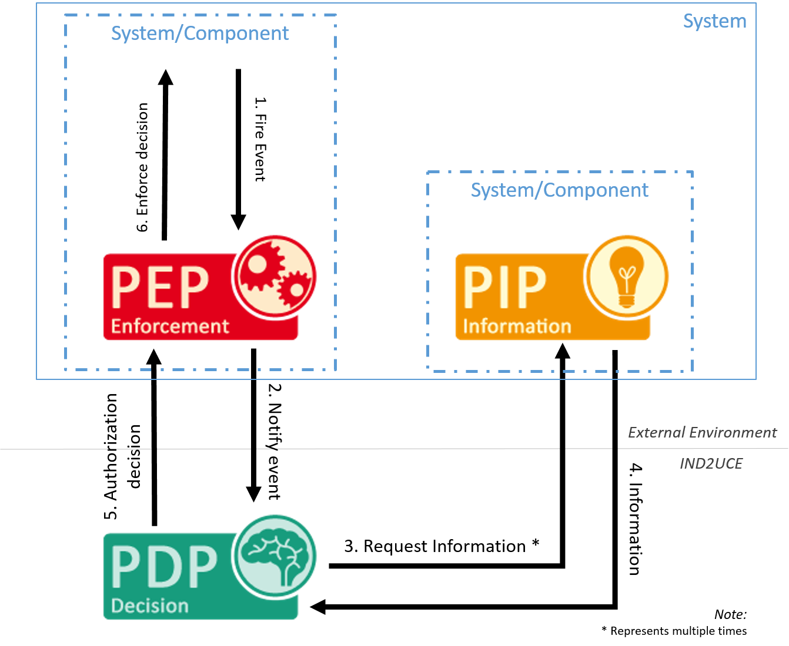

# Developing your own Policy Information Point

<a name="overview"></a>
## Overview

By default, MY DATA Control Technologies does not have access to any information besides data that has been supplied by an incoming event or specified in the policy (e.g., using constants). 
However, there are a lot of examples where this is not enough and additional information is required for a security decision.
Examples might be: 

* **Context:** Is the user currently in his office, or traveling?
* **Directory Information:** Which role does a user have?
* **Settings:** Did the user enable certain privacy settings?
* **Weather:** Is it currently sunny?

To solve this issue, you can register so-called Policy Information Points (PIPs). 
PIPs extends MY DATA Control Technologies by the possibility to retrieve information that are independent from the current event. 

The PIP component is responsible for providing additional information to a PDP to support the decision making process.
The diagram below shows how a PDP requests information from a PIP component.

**Communication between PDP and PIP**


Writing your own PIP is straight-forward and follows three steps:

* Implement the functionality you need. To this regard, a PIP can be considered as a simple function (input: function name and parameters, output: result).
* When using MY DATA Control Technologies in cloud mode: Make your service available via a REST API so that it is reachable for remote PDP.
* Register it at the PMP (ideally via the [IMyDataEnvironment](howto_library.html#component-registration) abstraction), so that we know what it offers and where to reach it.

While you have to do the first thing on your own, the MY DATA Control Technologies SDK supports you in the second two steps.
Depending on whether you are using Spring (Boot) or not, you have two options.


<a name="sdk_pip"></a>
## Developing a PIP with our SDK

### Implement a PIP

```java
public class AuthorityPip {
  @ActionDescription(description = "Retrieves the authority (role) of a user")
  public String getAuthority(
        @ActionParameterDescription(name = "username", description = "The user the authority should be evaluated for.", mandatory = true) String username) {
    return "guest";
  }

  public HealthStatus getHealth() {
    return HealthStatus.of(Status.UP);
  }
}
```

### Registration

```java
IMyDataEnvironment myDataEnvironment = MyDataEnvironmentManager.getDefaultEnvironment();
ComponentId componentId = myDataEnvironment.registerLocalPip("authority", new AuthorityPip());
```


<a name="spring_pip"></a>
## Developing a PIP with our Spring SDK


<a name="service_spring"></a>
### Implement a PIP

The `PIP` actions can be implemented in a Spring Bean that is annotated with `@PipService`.
As `@PipService` is a sub-annotation of `@Component`, Spring will handle this class as a spring bean.
For each `PipService` class a developer has annotated, he has to specify the following:

* `componentName` which is a unique name on solution level to identify the component.
Will be expanded to `urn:component:<my-solution>:pip:<componentName>`.

The `PipService` class contains the actions the PDP should be able to call during policy evaluation.
Action methods are annotated with `@ActionDescription`, which has the following information specified:

* `methodName` (only required if the method name is not the same as the name used during policy specification
* `description` (optional) of the purpose of the PIP method
* for each parameter annotated by `@ActionParameterDescription`, the following information is specified:
** `name` (As Java drops the parameter names per default, this could not be introspected by the registration discovery)
** `description` (optional) of the purpose of the parameter.
** `mandatory` (default false) if the parameter is mandatory to use this PIP. Be aware when setting parameters with primitive datatypes as optional.In that case the default value of the datatype is assigned when the function is called.Better use wrapper datatypes as Boolean for example.

Here is an example for a PIP Action Method in an `PipService`:

```java
@PipService(componentName = "authority")
public class AuthorityPip {

  @Autowired
  private Repository repository;

  @ActionDescription(description = "Retrieves the authority (role) of a user")
  public String getAuthority(
        @ActionParameterDescription(name = "username", description = "The user the authority should be evaluated for.", mandatory = true) String username) {
    return repository.getRole(username);
  }
}
```

To enable autoregistration of PIPs in the MY DATA Control Technologies Library, [add the `@EnablePolicyInformationPoint` annotation to your Spring Application](howto_library.html#autoregistration_and_instantiation_of_pips).

<a name="service_healthcheck"></a>
### Providing health status data

Every PIP is able to provide data regarding its health status to the PMP.
This is done by providing a method with the signature
`HealthStatus getHealth()` within the PIP implementation.

This health information is exposed as a JSON response of the MY DATA Control Technologies HealthStatus.class when calling the /health endpoint of a `PipService`.

Here is an example for a PIP health status method in a `PipService`:

```java
@PipService(componentName = "authority")
public class AuthorityPip {

  @Autowired
  private Repository repository;

  @ActionDescription(description = "Retrieves the authority (role) of a user")
  public String getAuthority(
        @ActionParameterDescription(name = "username", description = "The user the authority should be evaluated for.", mandatory = true) String username) {
    return repository.getRole(username);
  }

  public HealthStatus getHealth() {
    return HealthStatus.of(Status.UP);
  }
}
```
