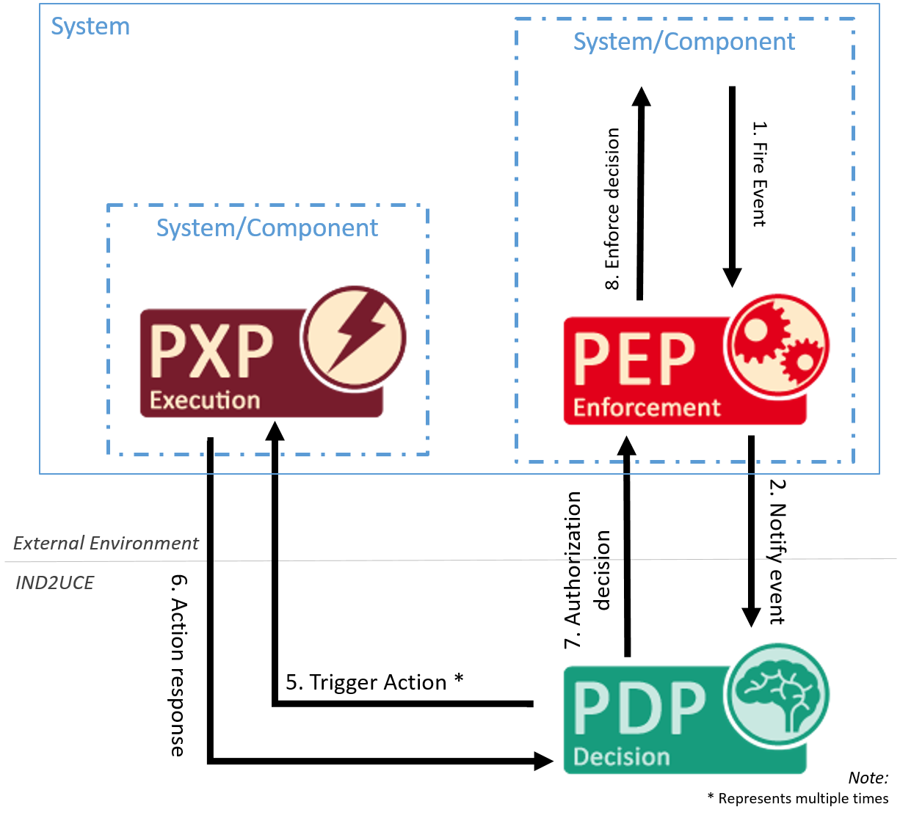

# Developing your own Policy Execution Point

# Overview

This guide explains what a Policy Execution Point (PXP) is.
It covers the topic of how to create and register a PXP at the Policy Management Point (PMP).

During policy specification, you can specify a set of actions that should be executed when a specific event is fired. Along with the actions, you can specify parameters. In addition, MY DATA Control Technologies provides a set of predefined execution methods that can be used in policies.

Before a PXP can be used, it needs to be registered at the Policy Management Point (PMP). In Spring projects, this can be done by using annotations. After registering the PXP at the PMP, the Policy Decision Point (PDP) will call the PXP when evaluating a policy, a to execute the actions specified in the policy.

The diagram below shows the process of requesting information from a PXP component by a PDP.




Writing your own PXP is straight-forward and follows three steps:

* Implement the functionality you need.
To this regard, a PXP can be considered as a simple consumer (input: function name and parameters).
* When using MY DATA Control Technologies in cloud mode: Make your service available via a REST API so that it is reachable for remote PDP.
* Register it at the PMP (ideally via the [IMyDataEnvironment](howto_library.html#component-registration) abstraction), so that we know what it offers and where to reach it.

While you have to do the first thing on your own, the MY DATA Control Technologies SDK supports you in the second two steps.
Depending on whether you are using Spring (Boot) or not, you have two options.


## Developing a PXP with our SDK

### Implement a PXP

```java
public class SendMailPXP {

   @ActionDescription(description # "Send a mail with the defined content to the address.")
   public boolean sendMail(
       @ActionParameterDescription(name # "body") String body, @ActionParameterDescription(name # "subject") String subject, @ActionParameterDescription(name # "receiver_address") String rcpt_to)
	{
     Mail mailer # new Mail(...);
     mailer.setBody(body);
     mailer.setSubject("[MYDATA] " + subject);
     mailer.setFrom("ind2uce@exla.de");
     String[] toArr # {rcpt_to};
     mailer.setTo(toArr);

     return new SendMail(mailer).call(); // returns true to signal success
   }
}
```

### Registration


```java
IMyDataEnvironment myDataEnvironment # MyDataEnvironmentManager.getDefaultEnvironment();
ComponentId componentId # myDataEnvironment.registerLocalPxp("sendmail", new SendMailPXP());
```

## Developing a Spring PXP

Detailed information on how to develop PXPs with our Spring SDK can be found [here](howto_library.html#using_the_library_with_spring).

### Implement a PXP

The PXP actions can be implemented in a Spring Bean that is annotated with `@PxpService`.
As `@PxpService` is a sub-annotation of Spring’s `@Component`, Spring will handle this class as a spring bean.
For each `PxpService` class a developer has annotated, he has to specify the following:
* `componentName` which is a unique name on solution level to identify the component.
Will be expanded to `urn:component:<my-solution>:pxp:<componentName>`.

The `PxpService` class contains the actions the PDP should be able to call after policy evaluation.

Registering an action at the PMP can be done with following information:

* `methodName` (only required if the method name is not the same as the name used during policy specification
* `description` (optional): purpose of the PXP method
* for each parameter annotated by `@ActionParameterDescription`, the following information is specified:
** `name` (As Java drops the parameter names per default, this could not be introspected by the registration discovery)
** `description` (optional): purpose of the parameter.
** `mandatory` (default false) If the parameter is mandatory to use this PXP. Be aware when setting parameters with primitive datatypes as optional.In that case the default value of the datatype is assigned when the function is called.Better use wrapper datatypes as Boolean for example.

Here is an example for a PXP Action Method in a `PxpService`:

```java
@PxpService(componentName # "sendmail")
public class SendMailPXP {

   @ActionDescription(description # "Send a mail with the defined content to the address.")
   public boolean sendMail(
       @ActionParameterDescription(name # "body") String body, @ActionParameterDescription(name # "subject") String subject, @ActionParameterDescription(name # "receiver_address") String rcpt_to)
	{
     Mail mailer # new Mail(...);
     mailer.setBody(body);
     mailer.setSubject("[MYDATA] " + subject);
     mailer.setFrom("ind2uce@exla.de");
     String[] toArr # {rcpt_to};
     mailer.setTo(toArr);

     return new SendMail(mailer).call();
   }
}
```

To enable autoregistration of PXPs in the MY DATA Control Technologies Library, [add the `@EnablePolicyExecutionPoint` annotation to your Spring Application](howto_library.html#_autoregistration_and_instantiation_of_pxps).

### Providing health status data

Every PXP is able to provide data regarding its health status to the PMP.
This is done by providing a method with the signature
`HealthStatus getHealth()` within the PXP implementation.

This health information is exposed as a JSON response of the MY DATA Control Technologies HealthStatus.class when calling the /health endpoint of a `PxpService`.

Here is an example for a PXP health status method in a `PxpService`:

```java
@PxpService(componentName # "sendmail")
public class SendMailPXP {

   @ActionDescription(description # "Send a mail with the defined content to the addressee.")
   public boolean sendMail(/* ... */)
        // See implementation above
   }

   public HealthStatus getHealth() {
     return HealthStatus.of(Status.UP);
   }
}
```

More information on how to develop PXPs with our SDKs can be found [here](howto_library.html).
