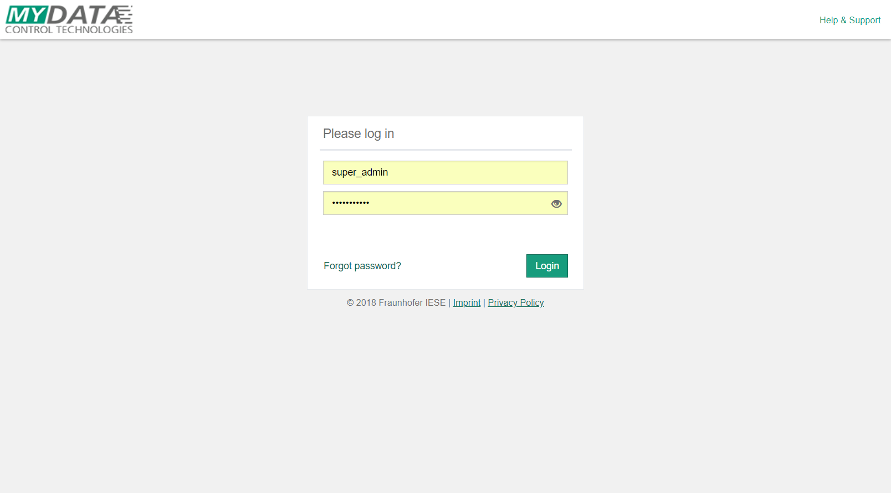
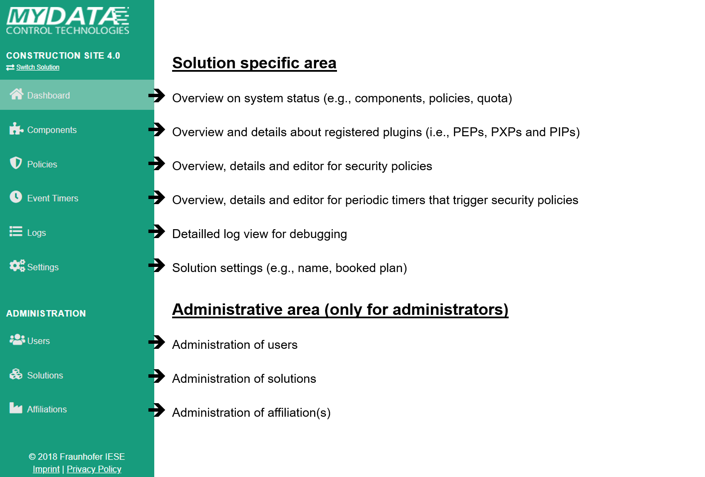
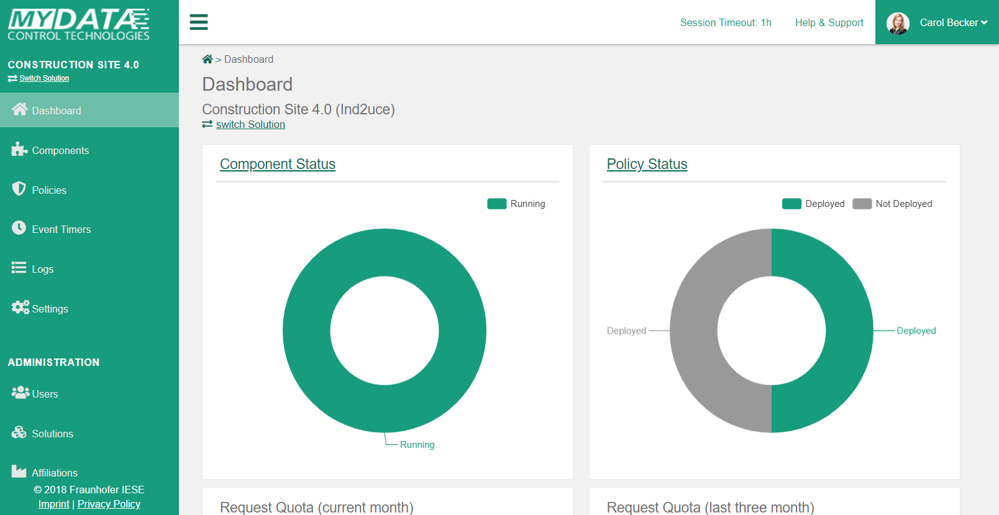
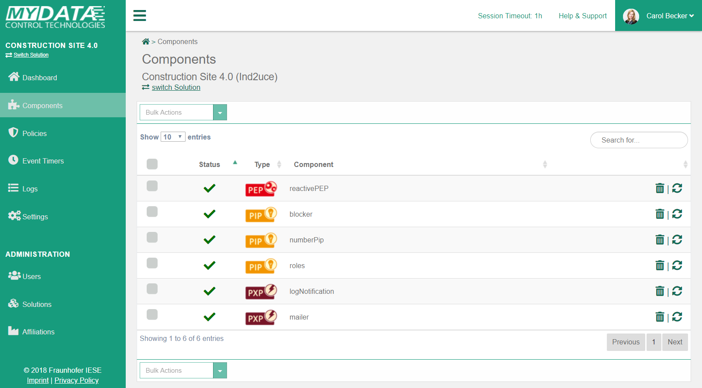
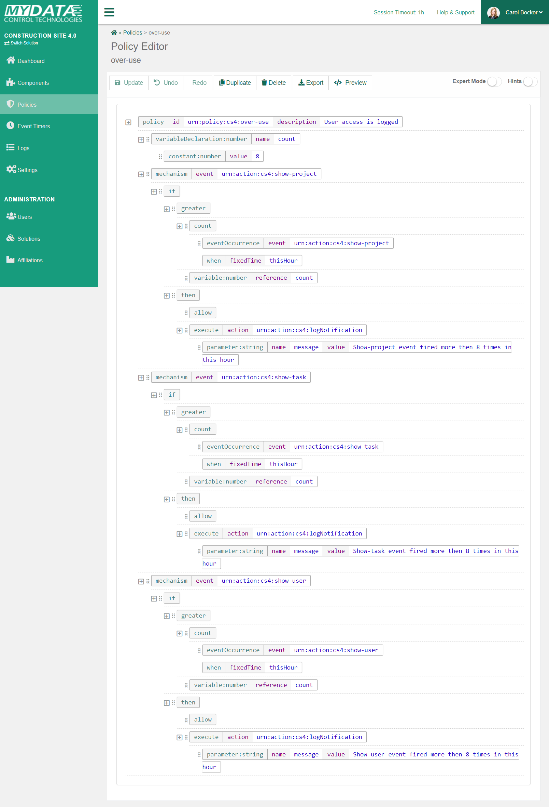
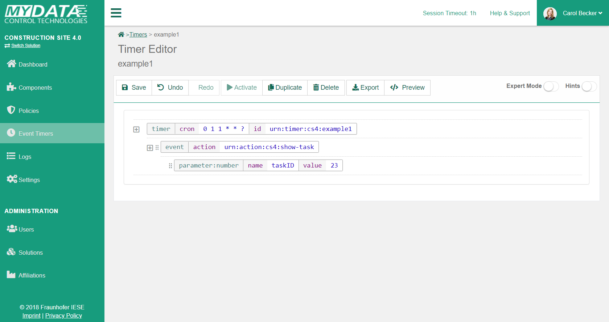
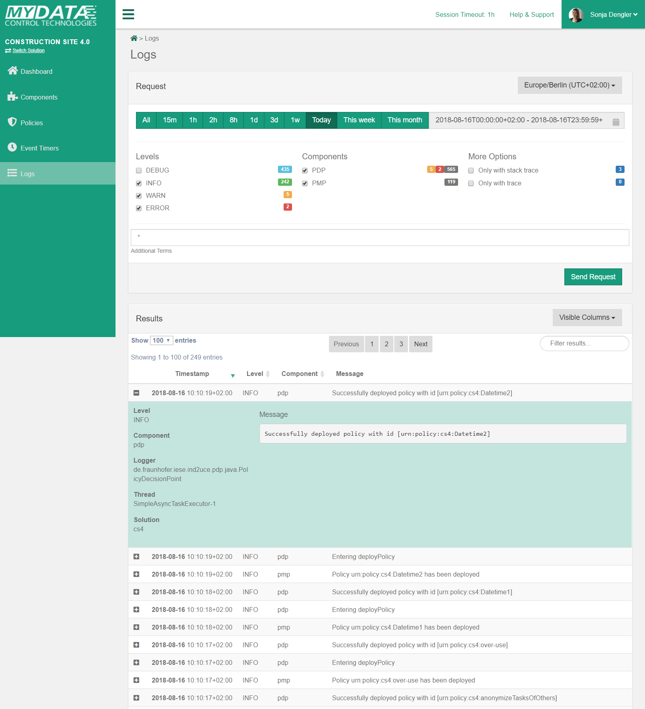
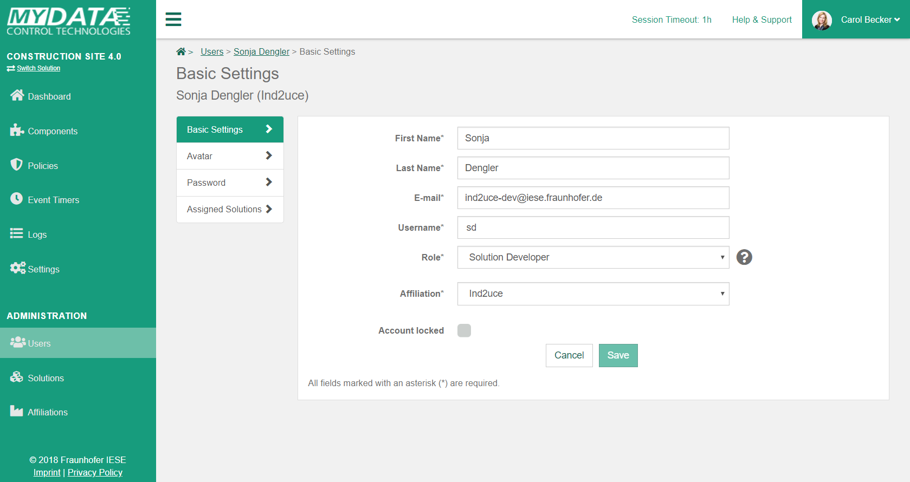
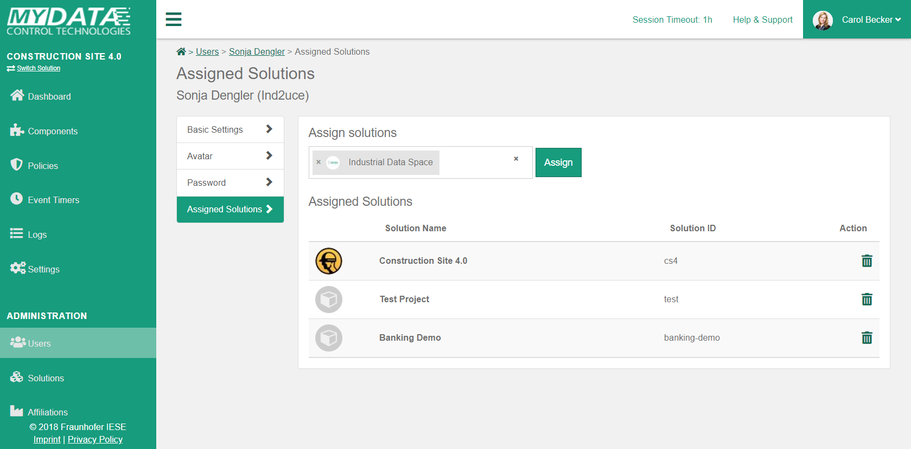
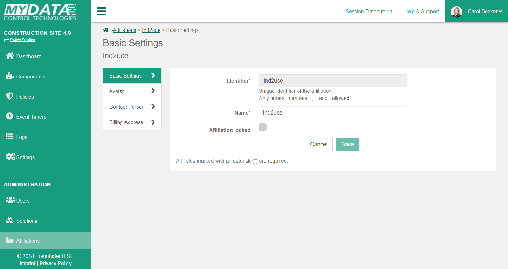

#  Management Service UI

## Overview

Our management service provides a web-based user interface for the management of Plugins ([PEPs](../glossary/#pep), [PXPs](../glossary/#pxp), [PIPs](../glossary/#pip)), [policies](../glossary/#policy), [users](../glossary/#user), [solutions](../glossary/#solution) and [affiliations](../glossary/#affiliation) (depending on your [role](../glossary/#roles)).

## Login
In order to use the management service, you need an account.
Accounts can be created by your administrators.
Once he did, you will receive an e-mail with instructions how to set your password.

## Navigation

After successful login, you see a menu with different options on the left side.

These options are divided into two sections. 

The first section is [solution](../glossary/#solution) specific - in the example screenshot, specific to the solution "Construction Site 4.0".
This means that when you, for example, click on "Policies", only the policies of the solution "Construction Site 4.0" are shown.
To change the solution, you can click on "Switch Solution" under the solution name.

The second section is the "Administration" section. 
Depending on your  [role](../glossary/#roles), it gives you the option to manage users, solutions or affiliations.

On the top, you can see the currently logged in user.
If you click on the user, you can [edit your profile](#administration-users) or log out.  
Next to the user, you can click on "Help & Support" to open our documentation.
The session timeout 

## Dashboard
The dashboard is the entry page of our service.
It provides an overview of several information, such as the status of [components](#components), the status of the [policies](#policies) and the request [quota](../glossary/#quota).

The dashboard is solution-specific. Thus, all information are relating to the currently selected solution.
The charts are interactive. If you hover or click on the charts, you will get more information or been redirected to the corresponding sites.

## Components
On the component page, you get an overview on all PEPs, PXPs and PIPs that are registered for the currently selected solution.
The table can be sorted by clicking on the table headers and filtered using the search field.

The status is indicating whether the component can be reached by our service.
You can update the status by clicking on the refresh icon.
As an administrator, you also have the option to delete (unregister) a component by clicking the trash bin icon.

> **ℹ️ NOTE**
> PEPs do need to communicate with our service, but do not need to be reachable themselves. Thus, even if a PEP is not reachable, it might work correctly. However, PXPs and PIPs need to be reachable.

By clicking on the name of the component, the detail view is shown.
In this detail view you see all registration details of the component. 
For example for a PEP, you see registered events and available modifiers.
By clicking on a row, it will expand and provide more detailled information.

## Policies

On the policies page, you get an overview on all policies of the currently selected solution.
The table can be sorted by clicking on the table headers and filtered using the search field or the tabs (All, Deployed, Not Deployed).

**Policies**

You can

* create a new policy by clicking on the "Create Policy" button (opens the [policy editor](#policies-policy-editor) with an empty policy).
* import a policy from your file system by clicking on the "Import Policy" button. You can upload single policies as XML files, or multiple policies as a ZIP archive.
* edit an existing policy by clicking on the corresponding row (opens the [policy editor](#policies-policy-editor))
* deploy or revoke a policy by switching the "Deployed" toggle
* delete a policy by clicking on the icon in the corresponding row 
* export a policy by clicking on the icon in the corresponding row 
* duplicate a policy by clicking on the icon in the corresponding row. Opens the [policy editor](#policies-policy-editor).

You can use bulk actions to perform an action on multiple policies simultaneously.
To do this, first select the desired policies and then select the action in the drop-down menu.
The following bulk actions are available:

* Delete selected: All selected policies will be deleted. The action must be confirmed.
* Export selected: All selected policies will be exported as zip file.
* Deploy selected: All selected policies will be deployed.
* Revoke selected: All selected policies will be revoked.

> **ℹ️ NOTE**
> * Not all actions are always available. Buttons are shown or hidden depending on the current situation (e.g., you cannot deploy a policy that contain errors).
> * Policies can only be imported if 
>   * the relevant policy id does not yet exist
>   * the policy belongs to the current solution
> * Policies that contain errors cannot be deployed. If a policy is syntactically incorrect, a warning icon will be shown instead of the deploy toggle.

### Policy editor

#### Basics
The Policy Editor allows you to specify and edit policies.
In general, our policy editor is an XML editor with a lot of specification support (the default mode hides the real XML structure and uses a simpler notation). 
When you create a new policy, it will automatically create a policy skeleton. 

The red exclamation marks indicate errors in the policy. By clicking on them, you can get more information. 
In the following example, the policy is missing several attribute values and several children in order to be correct.
Yellow exclamation marks warn you of potential problems, but do not necessarily indicate a problem.

> **⚠️  IMPORTANT**
>  
> * A policy with an error can be saved - but not deployed.
> * A policy with a warning can be saved and deployed.

In order to fill out attributes, click on the white area after the attribute name. It will open a modal that allows you to set the value.
Modals differ depending on the attribute. In general, the editor provides you only options that are valid. 
For example in the following figure, you see that registered events are shown as a list when you want to set the "event" attribute of the "mechanism" tag.

In order to add children to a tag, you click on the tag name. Again, the editor will suggest you only valid options.
In order to remove a tag again, you click on the tag name of the tag to be deleted and select "Delete". 

> **ℹ️ TIP**
> The menus support "filter as you type". Use the arrow keys to select a menu item and press Enter to confirm. ESC closes the menu.

The policy editor supports drag’n’drop. You can use it by dragging a tag at the  icon in front of the tag name.
Little grey dots indicate where you can drop the tag (according to the type).

#### Action Bar

At the top of the policy, you have several options in an action bar (from left to right):

* Save or update the policy
* Undo changes
* Redo changes
* Deploy a policy (needs to be saved before)
* Duplicates the policy and opens the copy. 
* Delete a policy. The deletion must be confirmed and cannot be reverted.
* Export a policy as XML file. Exported policies can be re-imported.
* Preview of the policy as XML (opens modal)

Furthermore, you can enable the expert mode and hints using the toogles on the top right.
The expert mode will give you more freedom in specification and shows the policy in XML format. However, you need to take care about potential specification errors.
By enabling hints, you can directly jump to the language documentation of a specific language element by clicking on the hint icons.

## Event Timers
Event timers can be used to specify cron jobs that periodically trigger certain events (that in turn might trigger policies). 
The overview and editor work just like the policy overview and editor. 

Please refer to our [language documentation](../language/#timer) for more information about the timer syntax.

## Logs
The logs page allows to view, search and filter the log data generated by the PMP and PDP.

By default, today’s warning and error logs are displayed.
In the request area, the timerange and various search parameters can be adjusted:

* Timezone: The time zone can be set to the local user time, UTC or to that of the solution.
* Log level: Allows selection of different log levels.
* Component: Allows selection of the component (currently PDP or PMP)
* Stack traces: Allows to search for log messages that contain a stack trace.
* Trace IDs: Allows a search for log messages that contain a Trace ID.

Results are displayed in a table, the columns to be displayed can be adjusted via the btn:[Visible Columns] menu.
The results can be further restricted using the filter field.

By clicking on the corresponding log message, the detailed view is shown, in which additional information is displayed. 

## Settings
See [Solution settings](#administration-solutions)

## Administration

### Users

On the users page, you can manage user accounts.
If you are a solution developer, you can only edit your own account, which is directly shown.
If you are an administrator, you will see the list of users of your affiliation.
By clicking on a user, you can edit his account. 

The user account settings are divided into four tabs:

* **Basic Settings:** User details like name, e-mail, role and account status can be set here. If you lock a user, he is not able to log in anymore.
* **Avatar:** A profile picture can be set here
* **Password:** Change the current password of the user. The forgot password function sends an email to the user to reset his password.
* **Assigned Solutions:** Assign a developer to a solution

In each tab, you have to select "save" to store the information of the current tab.

In order to assign solutions, you can select them from the drop down list (multiple solutions are selectable) and click the assign button (see below). 

> **ℹ️ NOTE**
> Admins are always assigned to all solutions and thus do not have the fourth tab.

### Solutions

On the solutions page, administrators can manage solutions of their affiliation.
By clicking on a solution, you can edit it. 

The solution settings are divided into five tabs:

* **Basic Settings:** Solution details like ID, name, time zone and solution status can be set here. The time zone is relevant for billing purposes (quota per month) and the event history. If you lock a solution, it is disabled and no requests of this solution will be accepted anymore.
* **Avatar:** A solution picture can be set here
* **API Token:** Multiple API tokens can be created to access our API.
* **Assigned Solutions:** Assign a developer to a solution
* **Booked Plan:** You can change the booked [plan](../glossary/#plan) for a solution (e.g., upgrading from Free to Silver)

In each tab, you have to select "save" or "order" to store the information of the current tab.
In order to assign users to the solution, you can select them from the drop down list (multiple user are selectable) and click the assign button (cf. [administration-users](#administration-users)). 

> **ℹ️ NOTE**
> Admins are always assigned to all solutions.

### Affiliations
On the affiliations page, administrators can manage their affiliation.

The affiliation settings are divided into four tabs:

* **Basic Settings:** Affiliation details like ID, name, and status can be set here
* **Avatar:** An affiliation picture can be set here
* **Contact Person:** Contact detail of the contact person of this affiliation can be set here. The required information is the name, the telephone number and a valid email address of the contact person.
* **Billing Address:** Billing address for all solutions of this affiliation (required for non-free plans) 

In each tab, you have to select "save" to store the information of the current tab.
